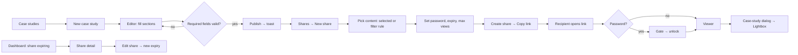

# Digital Covet Portfolio: UI/UX Design System & Implementation Plan

> **Assumptions**
> - **Stack conflict resolved.** The concept text says "Next.js", but the stack list says AdonisJS + Inertia.js. I treated the build as **AdonisJS (Vite) + Inertia + React 19**: pages live in `inertia/pages/`, layouts are Inertia persistent layouts, and fonts load via Fontsource or the Edge root template (not `next/font`). Tell me if it really is Next.js and I'll swap Sections 5–6 accordingly.
> - **"Futuristic" is expressed through restraint**, not neon, 3D or glassmorphism: dark-led surfaces, hairline geometry, instrument-style numerals and one red signal. The brand guide (v1.0, fetched from digitalcovet.com/branding) says red must be used "sparingly" and sets a 70% dark / 20% / 10% colour ratio, so a loud futurism would break the brand.
> - **Brand tokens are taken verbatim** from the guide. Everything else (surface steps, `--primary-text` on dark, semantic colours, mono font) is **derived by me** and flagged "derived".
> - **Light and dark both ship.** Workspace and share portal default to dark; the marketing page uses section-scoped dark/light bands like the current site.
> - **Component layer.** Base UI (`@base-ui/react`) has no Sidebar, Table, Card, Badge, Breadcrumb, Skeleton, Calendar or Command. The plan takes those from **shadcn/ui's Base UI flavour** (copy-in components) restyled by the tokens below.
> - **Inferred pages** (marked "(inferred)"): sign-in, case-study detail, share detail/analytics, error pages. Case-study cards on the marketing page are display-only because no public case-study detail route exists.
> - The logo file sits behind a WorkDrive link I couldn't open; `LogoMark` is a placeholder for it.

**Inputs**
- **Concept:** Internal portfolio tool for Digital Covet: public marketing site, authenticated workspace (case studies, clients, taxonomies, shares), and password-protected public share portals.
- **Audience:** Digital Covet's internal team (employee / admin / superadmin) daily; external recipients of share links occasionally.
- **Platform / stack:** Web, AdonisJS + Inertia.js + React 19 + Base UI.
- **Brand attributes:** Futuristic, anchored to the Digital Covet brand guide (Brand Red `#c2202d`, Near Black `#333132`, Jost + Rubik).

---

## 1. Strategic Design Direction & Trend Fit

**Primary paradigm: Minimalist Data-Dense (leads), with Swiss/International grid discipline.** A **Bento Grid** is used only on the two portfolio-facing surfaces (marketing "Selected work" and the share portal). Staff do repeated catalogue work (filter, edit, publish, share), so speed of scanning beats spectacle; the Swiss grid and hairlines supply the "engineered" feel that reads as futuristic without costing time.

**Category benchmarks** (patterns only, no brand elements):

| Product | Pattern to borrow |
|---|---|
| **Linear** | Persistent sidebar, dense filterable lists, ⌘K palette, keyboard-first |
| **Sanity Studio** | Document editor with status and save state in the header, metadata in a side rail |
| **DocSend / Papermark** | Share-link settings (password, expiry, view cap) and per-visit analytics |
| **Vercel dashboard** | KPI strip → primary chart → recent activity hierarchy |

**Experience mode per surface**

| Surface | Mode | Why |
|---|---|---|
| Marketing `/` | **Expressive** | First brand impression for clients and recruits; one hero signature, no scroll-jacking |
| Sign-in (SSO) | **Utility** | A redirect; speed and clarity |
| Workspace (`/dashboard`, `/case-studies`, `/clients`, `/taxonomies`, `/shares`) | **Utility** | Daily catalogue work; motion only clarifies state |
| Share portal `/shares/[token]` | **Expressive** | External clients judge the agency by this page; gallery lightbox is the one rich interaction |

**Signature elements**

1. **Covet Grid.** 48px square hairline grid: `rgb(255 255 255 / 0.05)` on dark, `rgb(51 49 50 / 0.06)` on light, with 12px **registration ticks** in `--primary` at intersections along one edge, masked by a radial fade to 0 at 70% radius. *Meaning:* measured, engineered work. *Placement:* marketing hero, share gate and portal hero, sign-in, 160px patches in empty states. *Rules:* static CSS/SVG, `aria-hidden`, never behind tables or forms. Worst case (white 6% line under text) text contrast is 15.99:1.
2. **Signal Line.** A 1px `--hairline` with a short `--primary` segment (2px × 20px, or 24px wide on horizontals) marking *where you are*: active nav bar, active tab underline, KPI card top edge, selected table row, page-load progress bar. *Rule:* one red segment per component; static except the progress bar.
3. **Telemetry type.** Every measured value (KPIs, view counts, expiry countdowns, slugs, file sizes, share URLs, timestamps) is set in JetBrains Mono 500, tabular, under a Rubik 500 10–12px ALL-CAPS label (+12% tracking), e.g. `VIEWS · 30D`. *Rule:* never prose, never buttons.
4. **Halo.** The single focal element on a screen gets `0 0 0 1px primary/40%, 0 0 32px primary/12%`. *Rule:* **one Halo per screen** (primary KPI on the dashboard, the copy-link field after a share is created, the focused password field on the gate).

**Why this fits the audience.** The team already knows the brand, spends hours in lists and forms, and shows this tool to clients. A dark, hairline-and-telemetry look feels futuristic on first sight, while the layout stays the boring, learnable shell they expect from Linear-class tools.

**Anti-patterns for this product**
- **Neon glow or blurred glass panels everywhere.** Pushes red far above the brand's 10% share, dilutes the primary action's signal, and `backdrop-filter` taxes staff laptops.
- **Brand Red for both "Publish" and "Delete".** Staff will mis-click. Destructive actions use outline style + `Trash2` icon + typed/named confirmation; Error colour is coral (`#FF8A80`), not brand red.
- **A terminal-style monospace UI.** Reads as a developer tool to designers and account managers. Mono is confined to numerals.
- **Scroll-jacked or 3D scenes on the portal.** Recipients open links on phones between meetings; heavy scenes hide the work and hurt LCP.
- **Silently hiding what a role can't do.** Employees can read taxonomies but not write them; show disabled controls with an explanation rather than missing buttons. (Exception: **Clients** is admin+ and is hidden from employees' nav, because it has no employee-readable view.)

---

## 2. Visual Language & Ergonomics

### Colour

**Core palette (all contrast values verified with the bundled checker).** Dark is the default for workspace and portal.

| Role | Token | Dark | Light | Usage | Verified contrast |
|---|---|---|---|---|---|
| **Primary** | `--primary` | `#c2202d` (Brand Red) | `#c2202d` | Primary buttons, Signal Line, focus accent. *Fill only* on dark | White label on fill **5.93:1**. Light: red text on white **5.93**, on `#eae8e9` **4.87** |
| | `--primary-text` *(derived)* | `#FF6B77` | `#c2202d` | Red *text/icons* on dark (links, active icon) | On canvas **6.70**, card **6.14**, popover **5.37**, sidebar **7.03** |
| **Secondary** | `--secondary` | `#333132` (Near Black) | `#333132` | Dark: raised fills, selected rows. Light: body text and the **sidebar** | White on it **12.91:1**; light: on white **12.91**, on canvas **11.87** |
| **Accent** | `--accent` | `#d93040` (Red Light) | `#9c1924` (Red Dark) | Hover/pressed on primary, chart series, ticks | White label on Red Light **4.72:1**; on Red Dark **8.15:1** |
| **Background / Canvas** | `--background` | `#161314` *(derived)* | `#F6F5F5` *(derived)* | Page background | Dark: white **18.46**; light: `#333132` **11.87** |
| **Surface / Card** | `--card` | `#1F1C1D` *(derived)* | `#FFFFFF` | Cards, tables, picker tiles | Dark: white **16.91**; light: `#333132` **12.91** |

**Text tokens** (Soft Gray is *never* used for text, per the brand guide, so dark-mode text is White at alpha):

| Token | Dark | Contrast (canvas / card / popover) | Light | Contrast (white / canvas / `#eae8e9`) |
|---|---|---|---|---|
| `--fg-1` headings, values | `#FFFFFFEB` | 15.71 / 14.47 / 12.77 | `#333132` | 12.91 / 11.87 / 10.59 |
| `--fg-2` body | `#FFFFFFB8` | 9.88 / 9.29 / 8.40 | `#4a4748` | 9.19 / 8.44 / 7.53 |
| `--fg-3` meta, captions | `#FFFFFF8F` | 6.37 / 6.13 / 5.69 | `#5F5B5C` | 6.69 / 6.15 / 5.49 |

**Semantic colours** (always paired with an icon and a word, never hue alone):

| State | Dark | On canvas / card / popover | Light | On white / canvas | Icon + word |
|---|---|---|---|---|---|
| Success | `#3DDC97` | 10.45 / 9.57 / 8.37 | `#0F7B4C` | 5.31 / 4.88 | `CircleCheck` "Published", "Active" |
| Warning | `#FFB84D` | 10.74 / 9.83 / 8.61 | `#8A5300` | 6.33 / 5.82 | `TriangleAlert` "Expiring" |
| Error | `#FF8A80` | 8.09 / 7.41 / 6.48 | `#B3261E` | 6.54 / 6.01 | `OctagonX` "Failed", "Expired" |
| Info | `#5CC8FF` | 9.81 / 8.99 / 7.86 | `#0B6A99` | 5.94 / 5.46 | `Info` |

Neutral statuses (Draft, Archived) use `--fg-3` with `Pencil` and `Archive` icons.

**Colour ratio.** Dark surfaces ≈ 70% of pixels, light text and neutrals ≈ 20%, red ≈ 10% (matches the guide's 70/20/10).

**Controls and light-mode sidebar.** Input/checkbox borders `--input`: dark `#7C7778` (3.36 on popover, 3.84 on card, 4.19 on canvas); light `#8C8788` (3.54 on white, 3.25 on canvas). The light-mode sidebar is **Near Black `#333132` always** (matching the brand's dark header): white text 12.91, `--fg-2` 7.54, `--fg-3` 5.23, `#FF6B77` icons 4.69. The active sidebar item keeps **white text** (10.86 over the red-tint fill) and shows red only as the bar and icon.

### Surface levels

| Level | Token | Dark | Light | Border | Shadow |
|---|---|---|---|---|---|
| 0 Canvas | `--background` | `#161314` | `#F6F5F5` | none | none |
| 0s Sidebar | `--sidebar` | `#0F0D0E` | `#333132` | right: 1px `--hairline` | none |
| 1 Card / table | `--card` | `#1F1C1D` | `#FFFFFF` | 1px `--hairline` (`#2E2A2B` / `#eae8e9`) | dark none; light `0 1px 2px rgb(51 49 50 / .06)` |
| 2 Popover / Dialog / Sheet | `--popover` | `#2A2728` | `#FFFFFF` | 1px `--border-strong` (`#3A3637` / `#D6D3D4`) | dark `0 12px 32px rgb(0 0 0 / .5)`; light `0 12px 32px rgb(51 49 50 / .16)` |
| Scrim | `--scrim` | `rgb(15 13 14 / .64)` | `rgb(51 49 50 / .48)` | | |

`--hairline` and `--border-strong` are decorative separators; interactive boundaries use `--input`.

### Typography

- **Heading / nav / buttons: Jost** (variable, Google Fonts). **Body / forms / captions: Rubik.** **Numerals only: JetBrains Mono** *(derived third face; free)*.
- **Brand scale kept for marketing and portal:** Hero Jost 800, 56–72px, −3%; H1 800, 36–42px, −2%; H2 700, 26–30px, −1%; H3 600, 18–22px. Fluid display tier: `clamp(3.5rem, 2.4rem + 3.4vw, 4.5rem)`.
- **App scale (Utility, ratio ≈ 1.25):** label 12 / body-dense 14 / body 15 / h3 18 / h2 22 / page title 28 (Jost 700, −1%) / KPI value 32 (mono). Line-heights: body 1.6 (forms) and 1.7 (markdown, portal), dense 1.45.
- **Deviations from the guide:** (a) body is **Rubik 400**, not 300, on dark (Light weight thins out on near-black); 300 stays for long-form on light. (b) Tables use 14px for density (guide minimum is 15px).
- Labels: Rubik 500, 11–12px, uppercase, +12% tracking.
- Tabular numerals: set `font-variant-numeric: tabular-nums` globally; measured values use the mono face.

### Iconography & imagery

- **`lucide-react`**, stroke 1.75. Sizes: 16 (inline, badges, KPI headers), 20 (nav, buttons), 24 (empty states). Icons are **required** on every nav item, primary and secondary buttons, status badges and section headers.
- **Client logos** always sit on a white 8px-padded chip (`#FFFFFF`, radius 6px) because supplied logos are authored for light backgrounds.
- **Case-study images:** 16:9, radius 12px, inset 1px `--hairline` overlay so dark images don't dissolve into the canvas.
- **Empty states:** Covet Grid patch + 24px icon in a 48px circle; no illustration pack.

### Layout

- **Grid:** 12 columns, gap 24px. Breakpoints: `sm 640`, `md 768`, `lg 1024`, `xl 1280`, `2xl 1536`. Spacing base 4px (4/8/12/16/24/32/48/64/96).
- **Density:** workspace compact (controls 36–40px, table rows 44–56px); marketing and portal comfortable (controls 48px).
- **Touch targets:** 44×44px on the portal and marketing page and below `md` everywhere; workspace desktop controls ≥ 36px (WCAG 2.2 AA minimum is 24px).
- **Region sizing:** sidebar 256px → 64px rail; case-study editor = fluid main (content ≤ 880px) + **360px** metadata rail; share builder = fluid + **400px** settings rail; dashboard chart/side = **8 / 4** columns; KPI strip 4 equal.
- **Wide screens (> 1440px):** workspace content capped at **1360px**, centred; portal and marketing content 1280px, hero and image bands full-bleed; reading text 68ch.
- **Proximity:** settings sit beside the action they modify (the Create share button lives in the rail footer under the protection settings).

### Design tokens

```css
:root {
  /* brand (verbatim) */
  --brand-red: #c2202d; --brand-red-dark: #9c1924; --brand-red-light: #d93040;
  --brand-near-black: #333132; --brand-charcoal: #4a4748; --brand-soft-gray: #eae8e9;

  /* semantic, light */
  --background: #F6F5F5;  --card: #FFFFFF;  --popover: #FFFFFF;
  --sidebar: #333132;     --sidebar-fg: #FFFFFF;
  --fg-1: #333132;  --fg-2: #4a4748;  --fg-3: #5F5B5C;
  --primary: #c2202d;  --primary-text: #c2202d;  --primary-fg: #FFFFFF;
  --accent: #9c1924;   --secondary: #333132;
  --hairline: #eae8e9; --border-strong: #D6D3D4; --input: #8C8788;
  --scrim: rgb(51 49 50 / .48);
  --success: #0F7B4C; --warning: #8A5300; --error: #B3261E; --info: #0B6A99;
  --ring: #c2202d;

  /* type */
  --font-heading: "Jost Variable", "Jost", ui-sans-serif, system-ui, sans-serif;
  --font-body: "Rubik Variable", "Rubik", ui-sans-serif, system-ui, sans-serif;
  --font-mono: "JetBrains Mono Variable", ui-monospace, "SF Mono", Menlo, monospace;
  --text-label: 0.75rem; --text-dense: 0.875rem; --text-body: 0.9375rem;
  --text-h3: 1.125rem; --text-h2: 1.375rem; --text-title: 1.75rem; --text-kpi: 2rem;
  --text-display: clamp(3.5rem, 2.4rem + 3.4vw, 4.5rem);

  /* shape + layout */
  --radius: 0.5rem; --radius-lg: 0.75rem;
  --sidebar-width: 256px; --sidebar-rail: 64px; --topbar-h: 56px;
  --container-max: 1360px; --portal-max: 1280px; --editor-rail: 360px; --settings-rail: 400px;
  --measure: 68ch; --grid-size: 48px;

  /* motion */
  --duration-fast: 100ms; --duration-base: 160ms; --duration-slow: 240ms; --duration-scene: 400ms;
  --ease-out: cubic-bezier(0.2, 0, 0, 1); --ease-in-out: cubic-bezier(0.4, 0, 0.2, 1);
}
.dark {
  --background: #161314; --card: #1F1C1D; --popover: #2A2728; --sidebar: #0F0D0E;
  --fg-1: #FFFFFFEB; --fg-2: #FFFFFFB8; --fg-3: #FFFFFF8F;
  --primary-text: #FF6B77; --accent: #d93040; --secondary: #333132;
  --hairline: #2E2A2B; --border-strong: #3A3637; --input: #7C7778;
  --scrim: rgb(15 13 14 / .64);
  --success: #3DDC97; --warning: #FFB84D; --error: #FF8A80; --info: #5CC8FF;
  --ring: #FF6B77;
}
[data-surface="dark"] { /* marketing/portal bands that stay dark in light mode */
  --background: #161314; --card: #1F1C1D; --fg-1: #FFFFFFEB; --fg-2: #FFFFFFB8;
  --fg-3: #FFFFFF8F; --primary-text: #FF6B77; --hairline: #2E2A2B;
}
@media (prefers-reduced-motion: reduce) {
  :root { --duration-fast: 0ms; --duration-base: 0ms; --duration-slow: 0ms; --duration-scene: 0ms; }
}
@theme inline {
  --color-background: var(--background);  --color-card: var(--card);
  --color-popover: var(--popover);        --color-sidebar: var(--sidebar);
  --color-foreground: var(--fg-1);        --color-muted-foreground: var(--fg-3);
  --color-primary: var(--primary);        --color-primary-foreground: var(--primary-fg);
  --color-accent: var(--accent);          --color-border: var(--hairline);
  --color-input: var(--input);            --color-ring: var(--ring);
  --font-sans: var(--font-body);  --font-heading: var(--font-heading);  --font-mono: var(--font-mono);
  --radius-md: var(--radius);     --radius-lg: var(--radius-lg);
}
```

---

## 3. Motion & Immersion Strategy (Necessity Analysis)

| Tier | Marketing `/` | Workspace | Share portal |
|---|---|---|---|
| 1. Micro-interactions & transitions (CSS, Base UI data attributes, Motion) | **YES** | **YES** | **YES** |
| 2. Scroll-linked choreography | **SELECTIVE** (section reveals only; no pinned scenes) | **NO** | **NO** |
| 3. Interactive vector (Lottie / Rive) | **NO** | **NO** | **NO** |
| 4. High-fidelity 3D | **NO** | **NO** | **NO** |

**Reasoning.**
- **Tier 1 is the workhorse.** Base UI exposes `data-starting-style` / `data-ending-style` on popups, so dialogs, menus, tooltips and toasts animate with plain CSS transitions and zero JS. `motion` is used only where layout must animate (the lightbox expanding from its thumbnail, the sidebar indicator).
- **Tier 2 on marketing only.** Reveals add polish to the brand's public face, and CSS scroll-driven animations (`animation-timeline: view()`) cost nothing in JS. Cost: Firefox support lagged into 2026 (re-verify), so everything sits behind `@supports` and the unsupported path shows content immediately. No Lenis, no pinned scenes: they would slow a page whose job is "see work, get in touch".
- **Tier 2 off in the workspace and portal.** Staff need orientation; recipients need the work. Scroll effects here would only add INP and motion-sensitivity cost.
- **Tier 3 and 4 are NO.** Futurism comes from the Covet Grid, hairlines and telemetry numerals, not asset weight. A 3D hero would put a canvas near the LCP path on a page that must render as DOM text fast, and the portal must work on a recipient's mid-range phone.
- **Costs avoided:** no bundle growth for Three.js/Lottie; no GPU/battery draw on the portal; LCP stays a text or image element.

---

## 4. Animation & Interaction Blueprint

Easing `--ease-out` for entrances, `--ease-in-out` for state swaps. Only `transform` and `opacity` animate.

| # | Element | Trigger & behaviour | Purpose | Reduced motion |
|---|---|---|---|---|
| 1 | **Sidebar collapse** | Toggle or `⌘B`/`Ctrl B`: width 256 ↔ 64px over `--duration-slow` (240ms); labels fade over 120ms | Reclaim width without losing orientation | Instant swap |
| 2 | **Active-nav Signal Line** | On route change the 2×20px bar slides between items over 180ms (sidebar is a persistent layout, so it survives navigation) | Shows where you went | Bar jumps |
| 3 | **Navigation progress** | Inertia's progress bar tinted `--primary`, shown only after a 120ms delay so fast visits don't flash | Confirms a visit is running | Stays (it is a status, not decoration) |
| 4 | **Deferred widget reveal** (dashboard) | Skeleton → content crossfade 160ms as each `inertia.defer` prop lands; Chart.js line draws 400ms **on first mount only**, never on updates | Masks latency per widget, one at a time | Chart animation off; instant swap |
| 5 | **Popup enter/exit** (Dialog, Drawer, Menu, Popover, Tooltip) | Opacity 0→1 and 8px translate, 160ms, via `[data-starting-style]` / `[data-ending-style]`; Dialog scrim fades 160ms | Shows the layer relationship | Opacity only, 0ms |
| 6 | **Lightbox open** (portal) | Image expands from the clicked thumbnail rect (FLIP via `motion` `layoutId`), 280ms; swipe or arrow to change image with 160ms crossfade | Keeps spatial context in the gallery | 100ms fade, no expand |
| 7 | **Marketing reveals** | Sections fade up 16px over 400ms with `animation-range: entry 10% cover 30%`, *play* not scrub; cards stagger 60ms; stat numerals count up once over 800ms | Gives the public page rhythm | Everything visible and static |
| 8 | **Toast** (Base UI Toast) | Slides in 200ms; auto-dismiss 5s; timer pauses on hover and focus; errors persist | Confirms saves, copies, failures | Fade only |

---

## 5. Technical Implementation Roadmap

### Libraries

Verified against current docs (Oct 2026) unless marked **⚠ verify**.

| Package | Role | Status |
|---|---|---|
| `@base-ui/react` (v1.8 line) | Headless primitives: Dialog, Drawer, Menu, Select, Combobox, Autocomplete, Tabs, Toast, Tooltip, Popover, Field/Form, Switch, Toggle Group, Number Field, Progress, Meter, Scroll Area, Toolbar, Alert Dialog | Verified. Old name `@base-ui-components/react` is legacy |
| shadcn/ui, **Base UI flavour** (styles named `base-*`, e.g. `base-nova`) | Copy-in **Sidebar**, **Card**, **Badge**, **Breadcrumb**, **Data Table**, **Skeleton**, **Empty**, **Sheet**, **Pagination**, **Calendar / Date Picker**, **Command** | Component names verified; ⚠ verify the CLI's `components.json` setup against an AdonisJS/Vite layout, and whether `Command` ships a Base UI variant (fallback: Base UI `Dialog` + `Autocomplete`) |
| `@inertiajs/react` v3 + `@adonisjs/inertia` | Pages, persistent layouts, deferred props (`inertia.defer`), shared props. v3 requires React 19. In AdonisJS import `Link` and `Form` from `@adonisjs/inertia/react` | Verified |
| `lucide-react` | Icons | Verified (reference list) |
| `chart.js` + `react-chartjs-2` | Views-over-time charts (you already use Chart.js). Read colours from the CSS tokens so dark/light stay in sync; **dynamic-import** | `react-chartjs-2` ⚠ verify |
| `jspdf` (+ `jspdf-autotable`) | PDF export; **dynamic-import on click**. Embed Jost and Rubik TTFs so the PDF matches the brand | `jspdf-autotable` ⚠ verify |
| `@tanstack/react-table` | Engine for the Data Table | ⚠ verify |
| `motion` | Lightbox FLIP and sidebar indicator only (not `framer-motion`) | Verified (rename) |
| `@fontsource-variable/jost`, `/rubik`, `/jetbrains-mono` | Self-hosted fonts, preload Jost 800 and Rubik 400 | ⚠ verify names at install |
| `react-markdown` + `remark-gfm` + `rehype-sanitize` | Markdown preview and **portal rendering. Sanitising is mandatory because external users see staff-authored markdown** | ⚠ verify |

Keep your existing markdown editor; this plan specifies only its chrome. No Lenis, GSAP, Three.js or Lottie.

### Performance budget

- **Frame budget** 16.7ms (60fps); animate `transform`/`opacity` only; no `backdrop-filter` anywhere.
- **JS (gzipped):** workspace initial route ≤ 180 KB; marketing ≤ 90 KB; portal ≤ 120 KB. Chart.js, jsPDF and the markdown editor are **lazy** (≈ route-level and click-level splits).
- **Core Web Vitals "good":** LCP ≤ 2.5s, INP ≤ 200ms, CLS ≤ 0.1. LCP element: marketing = hero `h1` text; portal gate = `h1`; portal viewer = first card image with `fetchpriority="high"`; workspace = page title.
- **Images:** reserve `aspect-ratio: 16/9`; serve width variants (`srcset`) from the R2 public proxy ⚠ **needs a resize layer** (not in your feature list).
- **INP:** debounce search 250ms; keep table filtering server-side via Inertia partial reloads (`only`, `preserveState`, `preserveScroll`).
- **Inertia SSR:** enable for `/` and `/shares/[token]` so the hero and gate render without waiting for JS.

### Fallbacks

- **Reduced motion:** tokens zero all durations; Chart.js `animation: false`; marketing reveals render visible; lightbox cross-fades.
- **Low power / slow network:** nothing to degrade (no GPU effects); video embeds use a click-to-load poster facade.
- **No JS:** marketing and the portal gate are SSR'd; copy and CTAs remain reachable. The workspace requires JS.

### Code skeleton: app shell (Inertia persistent layout)

```tsx
// inertia/layouts/app_shell.tsx
import type { ReactNode } from 'react'
import { usePage } from '@inertiajs/react'
import { Link } from '@adonisjs/inertia/react'
import { LayoutDashboard, LibraryBig, Link2, Building2, Network, LogOut } from 'lucide-react'
import {
  Sidebar, SidebarContent, SidebarFooter, SidebarGroup, SidebarGroupLabel, SidebarHeader,
  SidebarInset, SidebarMenu, SidebarMenuItem, SidebarMenuButton, SidebarProvider, SidebarRail,
} from '~/components/ui/sidebar' // shadcn, Base UI flavour
import { TopBar } from '~/components/top_bar'
import { UserMenu } from '~/components/user_menu'

const RANK = { employee: 0, admin: 1, superadmin: 2 } as const
type Role = keyof typeof RANK

const NAV = [
  { label: 'Workspace', items: [
    { name: 'Dashboard', href: '/dashboard', icon: LayoutDashboard },
    { name: 'Case studies', href: '/case-studies', icon: LibraryBig },
    { name: 'Shares', href: '/shares', icon: Link2 },
  ]},
  { label: 'Library', items: [
    { name: 'Clients', href: '/clients', icon: Building2, minRole: 'admin' as Role },
    { name: 'Taxonomies', href: '/taxonomies', icon: Network },
  ]},
]

export default function AppShell({ children }: { children: ReactNode }) {
  const { url, props } = usePage<{ auth: { user: { name: string; role: Role } } }>()
  const { user } = props.auth

  return (
    <SidebarProvider defaultOpen /* cookie-persisted by the provider; ⌘B toggles */>
      <Sidebar collapsible="icon" className="bg-sidebar text-[--sidebar-fg]">
        <SidebarHeader className="h-14 px-4">{/* <LogoMark/> + wordmark "Portfolio" (Jost 700) */}</SidebarHeader>
        <SidebarContent>
          {NAV.map((group) => (
            <SidebarGroup key={group.label}>
              <SidebarGroupLabel>{group.label}</SidebarGroupLabel>
              <SidebarMenu>
                {group.items
                  .filter((i) => !i.minRole || RANK[user.role] >= RANK[i.minRole])
                  .map(({ name, href, icon: Icon }) => {
                    const active = url === href || url.startsWith(`${href}/`)
                    return (
                      <SidebarMenuItem key={href}>
                        {/* Base UI flavour composes with `render`, not `asChild` (⚠ verify prop name in generated file) */}
                        <SidebarMenuButton
                          isActive={active}
                          tooltip={name}
                          render={<Link href={href} />}
                          className="data-[active=true]:bg-primary/10 data-[active=true]:text-white
                                     data-[active=true]:before:absolute data-[active=true]:before:left-0
                                     data-[active=true]:before:h-5 data-[active=true]:before:w-0.5
                                     data-[active=true]:before:bg-primary"
                        >
                          <Icon className="size-5 data-[active=true]:text-[--primary-text]" aria-hidden />
                          <span>{name}</span>
                        </SidebarMenuButton>
                      </SidebarMenuItem>
                    )
                  })}
              </SidebarMenu>
            </SidebarGroup>
          ))}
        </SidebarContent>
        <SidebarFooter><UserMenu user={user} /></SidebarFooter>
        <SidebarRail />
      </Sidebar>

      <SidebarInset className="bg-background">
        <TopBar /> {/* SidebarTrigger (mobile), Breadcrumb, ⌘K trigger */}
        <main id="main" className="mx-auto w-full max-w-[--container-max] px-4 py-8 md:px-8">
          {children}
        </main>
      </SidebarInset>
    </SidebarProvider>
  )
}

// every workspace page opts in, so the shell never remounts between visits:
// Page.layout = (page: ReactNode) => <AppShell>{page}</AppShell>
// Reduced motion: handled globally by the zeroed duration tokens in Section 2.
```

### Phasing

1. **Tokens, fonts, shell** (Section 2 tokens, `AppShell`, `TopBar`, toasts, error pages).
2. **List and form patterns** (Data Table, FilterBar, Field wrappers, Empty/Skeleton).
3. **Dashboard** (deferred props, Chart.js, CSV/PDF export).
4. **Case-study editor + uploads** (presign, progress, gallery, markdown chrome).
5. **Shares: builder, list, analytics, then the portal** (gate, grid, dialog, lightbox).
6. **Marketing page**, then an accessibility and contrast pass.

---

## 6. App Shell & Page-by-Page UX Specification

> **How to build from this section.** Implement each page from its **component blueprint**, using the named components, variants and tokens from Sections 2 and 5. Proportion sketches show only relative size and position: do not reproduce their borders, box-drawing characters, monospace text or labels. Every app page renders inside the **App Shell** below, even though page blueprints omit it. Copy in quotation marks is final UI text; everything else is description.

### 6.1 Page inventory

| Page | Route | Purpose | Mode | Priority | Nav placement | Main data / endpoints |
|---|---|---|---|---|---|---|
| Marketing home | `/` | Public brand page: hero, stats, services, selected work | Expressive | Supporting | none (public) | Aggregates + latest published case studies |
| Sign-in (inferred) | `/login` | Start OIDC + PKCE with IAM | Utility | Utility | none | IAM redirect, session flash |
| Dashboard | `/dashboard` | Portfolio and share health | Utility | **Core** | Primary nav | Case-study and share stats, views series |
| Case studies | `/case-studies` | Find, filter, manage | Utility | **Core** | Primary nav | Paginated list + taxonomy filters |
| Case-study editor | `/case-studies/new`, `/case-studies/:id/edit` | Author and publish | Utility | **Core** | Contextual | CRUD, presigned uploads |
| Case-study detail (inferred) | `/case-studies/:id` | Read-only view and "shared in" | Utility | Supporting | Contextual | Case study + shares containing it |
| Clients | `/clients` | Client records, logos, key businesses | Utility | Supporting | Primary nav (admin+) | Clients CRUD, uploads |
| Taxonomies | `/taxonomies` | Sector → Industry → Key Business, categories, services, models | Utility | Supporting | Primary nav (read: all, write: admin) | Taxonomy CRUD |
| Shares | `/shares` | Manage share links | Utility | **Core** | Primary nav | Shares list + counts |
| Share builder | `/shares/new`, `/shares/:id/edit` | Compose and protect a share | Utility | **Core** | Contextual | Shares CRUD, match preview |
| Share detail (inferred) | `/shares/:id` | Per-share analytics | Utility | Supporting | Contextual | Views series, visits |
| Share portal | `/shares/:token` | External viewer: gate, grid, case studies, lightbox | Expressive | **Core** | none (public) | Token, unlock, published-only subset |
| Error pages (inferred) | 403 / 404 / 500 | Plain language and a way back | Utility | Utility | none | none |

Account menu holds: **Theme** (Light / Dark / System), **Manage account** (opens IAM), **Sign out**.

### 6.2 App shell & navigation

**Pattern: persistent left sidebar** (5 destinations, daily use) + top bar with breadcrumb and ⌘K. No bottom tab bar (laptop-first internal tool). Command palette `⌘K` / `Ctrl K` supplements the visible nav and carries global actions ("New case study", "New share") so no create button is duplicated in the sidebar.

```
AppShell  (Inertia persistent layout · SidebarProvider)
├─ Sidebar  (256px · collapsible to 64px rail ≤ 1280px · Sheet drawer < 768px · bg --sidebar)
│  ├─ SidebarHeader  LogoMark 28px + wordmark "Portfolio" (Jost 700 16px) · collapse control (PanelLeft, tooltip "Collapse sidebar  ⌘B")
│  ├─ SidebarGroup "Workspace"
│  │  ├─ NavItem Dashboard     (LayoutDashboard) /dashboard
│  │  ├─ NavItem Case studies  (LibraryBig)      /case-studies   trailing count (mono, fg-3): the signed-in user's drafts, hidden at 0
│  │  └─ NavItem Shares        (Link2)           /shares
│  ├─ SidebarGroup "Library"
│  │  ├─ NavItem Clients       (Building2)       /clients        admin+ only (hidden for employee)
│  │  └─ NavItem Taxonomies    (Network)         /taxonomies
│  └─ SidebarFooter  UserMenu: Avatar 32px + name + role label (caps, 11px) → Menu: Theme (Toggle Group) · "Manage account" (ExternalLink) · "Sign out" (LogOut)
└─ SidebarInset  (fluid · bg --background)
   ├─ TopBar  (56px · sticky · border-b --hairline · solid, no blur)
   │  ├─ SidebarTrigger (visible < 768px) · Breadcrumb (current page last, fg-1)
   │  └─ right: Button outline "Search…" (Search icon) with Kbd "⌘K"
   ├─ PageHeader  title (Jost 700 28px, -1%) · description (fg-2 15px) · actions right, max 2 buttons, only one primary
   └─ page content  (max 1360px, centred · px 32px ≥ 768px, 16px below)
```

- **Nav states.** Rest: `--fg-2` text. Hover: white 6% fill. **Active:** `bg primary/10`, white text, icon `--primary-text`, **Signal Line** 2×20px bar in `--primary` at the left edge. Focus-visible: 2px `--ring`, 2px offset.
- **Breakpoints.** ≥ 1280px expanded (user choice persists in the provider's cookie). 768–1279px defaults to rail; hover or focus on the rail shows tooltips; expanding overlays content rather than reflowing it. < 768px drawer from the TopBar trigger.
- **Global feedback.** Toast viewport bottom-right (bottom-centre < 768px). Adonis flash messages arrive as shared props and are shown as toasts once per visit.
- **Role gating.** Clients hidden for employees; write controls for taxonomies and others are disabled with a Tooltip stating the reason ("Only admins can edit taxonomies"), and the server stays authoritative.

### 6.3 Page specs

---

### Dashboard — `/dashboard` · Mode: Utility · Nav: Workspace › Dashboard
**User goal:** see portfolio and share health in under five seconds and jump to whatever needs attention. Success = a staff member finds an expiring share or a stale draft without opening another page.
**Entry points:** post-login landing, sidebar, ⌘K.

**Blueprint:**
```
PageHeader "Dashboard" · "Portfolio health and share activity."
  actions: Select "Range" (Last 7 days · Last 30 days · Last 90 days; default 30) · Select "Sector" (All sectors) · Menu button outline "Export" (Download) → "CSV" · "PDF"
KpiStrip  (grid 4 equal columns ≥ 1024px, 2 at md, 1 below)
  ├─ KpiCard "Published case studies"  Briefcase 16 · value mono 32 · delta vs previous range   [Halo]
  ├─ KpiCard "Drafts"                  Pencil 16 · value · link "Review drafts" → /case-studies?status=draft
  ├─ KpiCard "Active shares"           Link2 16 · value · sub "{n} expiring in 7 days" (Warning)
  └─ KpiCard "Share views"             Eye 16 · value for the range
MainGrid  (12 columns)
  ├─ Card span 8 "Views over time"  Chart.js line, 320px, one series in --accent, hairline gridlines, tooltip, no legend
  └─ Card span 4 "Top shares"       5 rows: recipient + company · views (mono) · status Badge · footer link "All shares"
LowerGrid  (6 / 6)
  ├─ Card "By sector"        rows: sector name · count (mono) · Meter bar in --primary
  └─ Card "Recently updated" Table 5 rows: thumb + title · status Badge · owner Avatar 24 · relative time (mono)
```
**Visual treatment:** *Focal point:* the "Published case studies" value (32px mono, Halo) and the chart line. *Surfaces:* canvas page; all widgets Level 1 cards; Export menu Level 2. *Icons/imagery:* 16px icons in KPI headers (`--fg-3`), status badges with icon + word, 24px owner avatars, 32×18 thumbs. *Density:* rows 44px, 24px between cards, 16px inside KPI cards. *Signature:* Signal Line along each KPI card's top edge, Telemetry type for every number.
**Layout:** KPI strip equal columns (equal-weight metrics); chart 8 / side 4 (chart is primary); lower row 6 / 6 (equal weight). Above 1536px the grid stays centred at 1360px.
**States:** *Loading:* per-widget Skeleton at final heights, arriving independently via `inertia.defer`. *Empty (no views):* inside the chart card, one message "No share views in this range" and one action "Create a share". *Empty (no case studies):* "Recently updated" shows "No case studies yet" + "New case study". *Error:* the failing widget shows an inline Alert with "Retry" (partial reload of that prop only); other widgets stay. Export failure → error toast.
**Interactions & motion:** Section 4 #3 and #4; range or sector change = Inertia `router.get` with `only: ['stats','viewsSeries','topShares']`, `preserveState`.
**Reduced motion:** chart renders fully drawn; skeleton swaps instantly.
**Responsive:** < 1024px KPI 2-up and main grid stacks (chart first); < 768px KPI 1-up, tables become 2-line rows.
**Accessibility:** one `h1`, `h2` per card; KPI cards are `dl` pairs; the chart has an `aria-label` summary and a visually hidden data table; Export menu is a Base UI Menu (arrow keys, Esc).
**Data:** `GET /dashboard?range&sector` → `stats` (immediate), deferred `viewsSeries`, `topShares`, `bySector`, `recent`. CSV is built client-side from props; PDF via dynamically imported jsPDF.
**Cut or merged:** one range control governs every widget (no per-card ranges); "Drafts" folded out of a status chart; no separate "Create" button (⌘K and list pages own creation).

---

### Case studies — `/case-studies` · Mode: Utility · Nav: Workspace › Case studies
**User goal:** find any case study in three interactions or fewer, then open, edit or add it to a share.
**Entry points:** sidebar, ⌘K, dashboard links (`?status=draft`).

**Blueprint:**
```
PageHeader "Case studies" · "{n} total · {n} published" (mono)
  actions: Toggle Group "View" (Table · Grid, icons only with tooltips) · Button primary "New case study" (Plus)
FilterBar  (sticky under TopBar, bg --background)
  ├─ Input (Search) "Search title, client or slug"   → ?q, debounce 250ms; "/" focuses
  ├─ Tabs "All · Published · Draft · Archived"        counts in mono; active tab = Signal Line underline
  ├─ Select "Sector" → Select "Industry" → Select "Key business"   (each enabled by the one before)
  ├─ Button outline "More filters" (SlidersHorizontal) → Popover: Combobox Category · Service · Client · Owner
  └─ Button ghost "Clear filters"  (only when a filter is active)
View=Table (default)  Card > DataTable
  columns: Checkbox · Case study (hero thumb 56×32 + title Jost 600 15 + slug mono fg-3) · Client (white logo chip + name)
           · Sector › Industry · Status Badge · Owner (Avatar 24 + name) · Updated (relative; mono absolute in tooltip) · RowMenu (MoreHorizontal)
  RowMenu: "Edit" · "Preview" · "Add to share" · "Archive" · "Delete" (Trash2, Error text; AlertDialog names the case study)
  BulkBar (slides up when ≥ 1 selected): "{n} selected" · "Add to share" · "Archive" · "Delete" (admin+)
View=Grid  grid auto-fill minmax(280px, 1fr): 16:9 image · client chip bottom-left · status Badge top-right · title · sector line
Pagination  "1–25 of 148" (mono) · Select "25 / 50 per page" · prev/next
```
**Visual treatment:** *Focal:* the Title column and the primary button. *Surfaces:* canvas, table inside one Level 1 card (radius-lg, hairline, `overflow: hidden`), sticky header row on `--card`. *Icons/imagery:* hero thumbnails, white client chips, status icons, 24px avatars. *Density:* 56px rows (thumbnail-driven), 12px cell padding, header labels in caps `--fg-3`. Row hover white 4%; selected row `primary/10` + Signal Line on the left edge. *Signature:* Signal Line (tab underline, selected row), Telemetry (counts, slugs, times).
**Layout:** table fills the container; Title flexible (min 320px), others fixed 120–160px. < 1024px hides Sector and Owner; < 768px forces Grid and removes the view toggle.
**States:** *Loading:* 8 skeleton rows matching the columns; on filter change old rows stay at 60% opacity with `aria-busy`. *Empty, no data:* Covet Grid patch + `LibraryBig` + "No case studies yet" + "Create your first case study". *Empty, filtered:* "No case studies match these filters" + "Clear filters". *Error:* inline Alert above the preserved table with "Retry". *Permission-limited:* rows owned by others in another department show Edit disabled with the tooltip "Owned by {name}, {department}".
**Interactions & motion:** Section 4 #5, #8; BulkBar slides up 160ms; `c` opens the editor, `/` focuses search.
**Reduced motion:** BulkBar appears without slide.
**Responsive:** see Layout; FilterBar scrolls horizontally below `md` instead of wrapping.
**Accessibility:** native `<table>` with `aria-sort` on sortable headers (Title, Updated; default Updated ↓); checkboxes labelled "Select {title}"; a polite live region announces "148 results" after each filter change; focus returns to the row menu trigger after any dialog.
**Data:** `GET /case-studies?q&status&sector&industry&keyBusiness&category&service&client&owner&sort&page` (all in the URL, shareable) → rows + `meta.counts`; `PATCH` status for archive; `DELETE /case-studies/:id`.
**Cut or merged:** the sidebar has no "New case study" button (the page header owns it; ⌘K offers it globally); the Status tabs replace a Status filter select.

---

### Case-study editor — `/case-studies/new`, `/case-studies/:id/edit` · Mode: Utility · Nav: contextual (sidebar highlights Case studies)
**User goal:** author a complete case study and publish it without losing work. Success = published with required fields and zero re-uploads.
**Entry points:** list "New case study", row "Edit", detail "Edit", ⌘K.

**Blueprint:**
```
EditorHeader  (sticky under TopBar; replaces PageHeader)
  ├─ Breadcrumb "Case studies" › "{title}" or "Untitled case study"
  ├─ Badge status (Draft · Published · Archived, icon + word) · SaveState "Saved {time}" (mono) | "Unsaved changes" (Warning) | "Couldn't save" (Error + "Retry")
  └─ actions: Button ghost "Preview" (Eye) · Button outline "Save draft" (Save) · Button primary "Publish" (SendHorizontal) · Menu (MoreHorizontal): "Archive" · "Delete"
     (when Published: "Save changes" replaces "Save draft", "Publish" is hidden, Menu adds "Unpublish")
Grid  fluid main (content max 880px) + MetaRail 360px
Main  (SectionHeader = icon + Jost 600 18px + hairline; sections separated by 40px, no nested cards)
  ├─ Title: borderless Input, Jost 700 28px, placeholder "Case study title"; slug line mono fg-3 "/{slug}" (read-only, set by server)
  ├─ Summary (FileText): Field Textarea 3 rows · counter "0 / 240"
  ├─ "Hero image" (Image): Dropzone 16:9 "Drop an image or browse" → Progress → preview with "Replace" · "Remove"
  ├─ "Gallery" (Images): sortable tile grid 96px, drag handle + remove, trailing "Add images" tile
  ├─ "Story" (BookOpen): Tabs "Write · Preview" + Toolbar (Bold, Italic, Heading, List, Link, Image, Quote, Code) over the markdown editor
  ├─ "Video" (Video): URL Inputs with provider detection (YouTube / Vimeo) · Collapsible 16:9 preview · "Add video"
  ├─ "Results" (BarChart3): rows Label · Value · Suffix Select (%, x, +) · remove; "Add metric" ghost
  ├─ "Testimonial" (Quote): Textarea quote · Input "Name" · Input "Role and company"
  └─ "Attachments" (Paperclip): rows file icon · name · size (mono) · remove; Button outline "Add file"
MetaRail  (sticky top 72px, Scroll Area)
  ├─ Card "Classification"  Combobox "Client" (logo chip in options; "New client" for admin+) · Select Sector → Industry → Key business · Combobox multi "Work categories" · "Services" · "Business models"
  └─ Card "Ownership"       Avatar + owner name · "Department" (read-only)
```
**Visual treatment:** *Focal:* the title field and the primary Publish button. *Surfaces:* main sections sit on canvas (hairline-separated, not boxed); rail cards Level 1; Dropzone and tiles Level 1 with dashed `--input` border. *Icons/imagery:* a Lucide icon on every section header; hero preview 16:9 radius 12. *Density:* 40px controls, 40px section gaps, 16px field gaps. *Signature:* Telemetry for slug, counts, file sizes, save time; Signal Line under the active Write/Preview tab.
**Layout:** main fluid with content capped at 880px, rail fixed at 360px (fixed rail because its content is short and stable). ≥ 1536px: Write and Preview go **side by side 50/50** (author compares while typing, so equal weight is right). 1024–1279px rail narrows to 320px; < 1024px the rail becomes a "Content / Details" Tabs pair.
**States:** *Loading:* skeleton title, 16:9 block, editor. *New:* empty form, Publish enabled but validates on click. *Validation:* inline `Field.Error` after blur, plus on submit an Alert listing missing required items (title, summary, hero image, client, sector) with focus moved to the first. *Uploading:* per-tile Progress; Save and Publish disabled with tooltip "Uploads in progress". *Upload failed:* tile shows Error icon + "Retry". *Conflict (inferred):* Dialog "This case study changed" with "Load latest" and "Keep my version". *Permission-limited:* read-only banner "You can view this case study but not edit it. Owned by {name}, {department}." with all fields disabled. *Empty sub-regions:* gallery shows only the "Add images" tile; Results shows "No metrics yet" + "Add metric".
**Interactions & motion:** `⌘S` saves; navigation with unsaved changes triggers an AlertDialog ("Leave without saving?"); successful publish → toast "Published" with a "View" link; Section 4 #5, #8.
**Reduced motion:** Dropzone drag highlight is colour-only.
**Responsive:** as Layout; Toolbar scrolls horizontally on touch.
**Accessibility:** Base UI Field labels and `aria-describedby` errors; sortable gallery supports keyboard (Space lifts, arrows move, live region announces position); Toolbar uses roving tabindex; one visually hidden `h1` "Edit case study"; section headers are `h2`.
**Data:** `GET /case-studies/:id/edit` + taxonomies as shared or deferred props; `POST /case-studies`, `PUT /case-studies/:id`; per-file `POST` presign → `PUT` to R2 (XHR for progress) → key stored; authenticated file-proxy URLs for previews. Slug uniqueness is server-handled (retry); the UI only displays the result.
**Cut or merged:** status lives only in the header Badge (no status select in the rail); one "Preview" button; no duplicate Save in the rail.

---

### Share builder — `/shares/new`, `/shares/:id/edit` · Mode: Utility · Nav: contextual (sidebar highlights Shares)
**User goal:** compose a link, protect it, and copy it. Success = link copied within two minutes of opening the page.
**Entry points:** Shares list "New share", case-study "Add to share" (preselects items), ⌘K.

```
Proportions only — do not reproduce
┌────────┬──────────────────────┬────────────┐
│Sidebar │ Content picker        │ Settings   │
│        │                       │ rail       │
│        │                       │            │
└────────┴──────────────────────┴────────────┘
1 picker fluid   2 rail 400px fixed, sticky   3 action in rail footer
```

**Blueprint:**
```
PageHeader "New share" (or "Edit share") · "Choose what recipients see, then set how they get in." · actions: Button ghost "Cancel"
Main
  ├─ SectionHeader "Content" (Layers) + Toggle Group single "Selected case studies · Filter rule"
  ├─ if Selected:
  │   ├─ Combobox "Add case studies" (search)
  │   └─ PickerGrid  3-up ≥ 1280px, 2-up ≥ 1024px: selectable Card (thumb · title · client chip · checkbox corner)
  │      selected = primary/10 fill + Signal Line + check; Draft/Archived items carry Badge "Hidden until published" (TriangleAlert)
  └─ if Filter rule:
      ├─ FieldGroup: Combobox multi Sector → Industry → Key business · Category · Service · Client (dependent options narrow as you pick)
      └─ MatchStrip  "{n} published case studies match" (mono) + 6 thumbs · polite live update, debounce 300ms
SettingsRail  (400px, sticky)
  ├─ Card "Recipient" (UserRound): Input "Recipient name" · Input "Company" · Input "Email" (optional)
  ├─ Card "Protection" (ShieldCheck):
  │   ├─ Switch "Require password" → reveals Input password (Eye toggle) + Button ghost "Generate"
  │   ├─ Field "Expires" → Popover Calendar with preset chips "7 days · 14 days · 30 days · No expiry"
  │   └─ NumberField "Max views" (empty = unlimited)
  ├─ Card "Link" (Link2) — only after create: read-only Input (mono URL) + Button icon "Copy link" [Halo] · "Created {date} · {n} views" (mono)
  └─ RailFooter (sticky bottom): Button primary full-width "Create share" (becomes "Save changes")
```
**Visual treatment:** *Focal:* the Content picker, then the "Create share" button; after creation the copy-link field takes the single Halo. *Surfaces:* picker tiles and rail cards Level 1 on canvas; calendar popover Level 2. *Icons:* section icons above; `Copy` swaps to `Check` for 1.5s. *Density:* comfortable, 40px controls, 16px gaps. *Signature:* Signal Line for selection state (no Halo on tiles, since Halo is one-per-screen); Telemetry for counts and URL.
**Layout:** fluid picker + fixed 400px rail, so the settings and the action that commits them sit together (proximity rule). ≥ 1536px picker goes 4-up and content stays capped at 1360px. < 1024px the rail stacks beneath with the footer button pinned to the bottom.
**States:** *Loading (edit):* skeleton cards and rail fields. *Empty picker:* "No case studies match your search" + "Clear search". *Empty match:* "No published case studies match this rule" + "Reset rule". *Error:* field errors inline; submit failure as an Alert at the top of the rail with "Retry". *Edit existing:* password field shows "Password set" + "Change" (never the stored value); expired share shows a Warning banner "This link expired {date}" with "Set a new date". *Permission-limited:* shares owned by others render read-only with the banner "Owned by {name}".
**Interactions & motion:** the password reveal expands over 160ms; switching Content mode keeps the other mode's selection in memory; success → toast "Share created", Link card appears, primary button becomes "Save changes".
**Reduced motion:** reveal appears instantly.
**Responsive:** as Layout; Toggle Group full width below `md`.
**Accessibility:** Toggle Group has radio semantics; picker cards are checkboxes (Space toggles); rail is `aria-label="Share settings"`; match count in an `aria-live="polite"` region; Copy announces "Link copied".
**Data:** picker uses the list endpoint (`status=published` default) via partial reloads; match preview `GET /shares/preview?filters` (inferred); `POST /shares` returns the token and URL; `PUT /shares/:id`. Public URL pattern `/shares/{token}`.
**Cut or merged:** "Create share" lives only in the rail footer; expiry presets merged into the date popover; the Link card exists only after creation; no separate "Recipient details" step.

---

### Share portal — `/shares/:token` · Mode: Expressive · Nav: none (public, external recipients)
**User goal:** a recipient sees the curated work quickly on any device. Success = first case study visible within 2.5s and no confusion at the password step.
**Entry points:** emailed link; often a phone.

**Blueprint, Gate (when password-protected):**
```
PortalGate  (min-height 100svh · centred column 420px · Covet Grid backdrop, masked)
  ├─ LogoMark + wordmark
  ├─ h1  "A private portfolio for {Recipient}"  (Jost 800, clamp 32–44px; "A private portfolio" when no name)
  ├─ Text "Enter the password you were sent to view this work."  (fg-2)
  ├─ Field Password (Input, Eye toggle, autofocus)  [Halo on focus]  ·  inline Error "That password isn't right. Try again."
  └─ Button primary full-width "View portfolio" (ArrowRight)
```
**Blueprint, Viewer:**
```
PortalHeader  (sticky 64px · solid · border-b --hairline with Signal Line segment at left)
  LogoMark + "Digital Covet" · right: label "PREPARED FOR {NAME}" (caps, hidden < 768px)
HeroBand  (data-surface="dark", full-bleed, Covet Grid)
  label "PORTFOLIO · {n} CASE STUDIES"  · h1 "Selected work for {Company}" (Jost 800, display clamp) · intro (fg-2, 18px, max 56ch)
SectorChips  (Toggle Group, scrolls horizontally; shown only when ≥ 8 items and ≥ 2 sectors)
CaseStudyGrid  (Bento, 12 columns, gap 24)
  CaseStudyCard  — first card spans 8 columns × 2 rows (feature), the rest span 4; < 768px one column
    16:9 image · client chip · label Sector (caps) · title (Jost 700 22px) · summary (2 lines) · "View case study" (ArrowUpRight)
CaseStudyDialog  (Base UI Dialog, full height; Drawer sheet < 768px; deep link ?cs={slug})
  ├─ hero image · h2 title · meta row: client chip · Sector › Industry › Key business · Service chips
  ├─ Story (markdown, sanitised, max 68ch)
  ├─ ResultsStrip: metrics in mono 32px with caps labels
  ├─ Video embeds (click-to-load poster)
  ├─ Gallery (masonry thumbs) → opens Lightbox
  ├─ Testimonial blockquote
  ├─ Attachments rows (FileText · name · size · Download)
  └─ footer: "Previous" · "Next" case study
Lightbox  (fullscreen, scrim #0F0D0E at 90%): image "contain" · Close (X) · Prev/Next (ChevronLeft/Right) · counter "3 / 12" (mono)
```
**Visual treatment:** *Focal:* the hero `h1` and the feature card. *Surfaces:* canvas page, hero band always dark (scoped tokens), cards Level 1, dialog Level 2. *Imagery:* 12px radius with inset hairline; white client chips. *Density:* comfortable (section padding 64/96px, card gap 24px). *Signature:* Covet Grid in the hero and gate, Signal Line in the header, Telemetry labels, Brand Red only on the primary button, the Signal Line and link hover underlines.
**Layout:** content capped at 1280px, hero band full-bleed; bento feature 8/4 deliberately asymmetric; reading column 68ch inside the dialog.
**States:** *Loading:* SSR, so the skeleton is only a fallback for the dialog's media. *Empty share (no published items):* "Nothing to show yet" + Button outline "Contact Digital Covet". *Unavailable:* one template with icon + h1: "This link has expired" / "This link has reached its view limit" / "This link isn't available" (not-found and revoked share the last wording to avoid leaking existence), text "Ask your Digital Covet contact for a new link.", Button "Visit digitalcovet.com". *Too many attempts:* "Too many attempts. Try again in {mm:ss}" (mono), button disabled. *Error:* media failure shows a neutral placeholder; the rest renders.
**Interactions & motion:** card hover lifts the image scale to 1.03 over 400ms; dialog enter 240ms; lightbox Section 4 #6; keyboard arrows navigate; Esc closes.
**Reduced motion:** no hover scale; dialog and lightbox use a 100ms fade.
**Responsive:** < 768px one column, compact header (recipient label moves into the hero), dialog becomes a swipe-to-dismiss Drawer, targets 44px; 768–1023px two columns; ≥ 1024px bento.
**Accessibility:** gate error is `role="alert"`; cards are single links with accessible names; dialog heading `h2`; lightbox traps focus and restores it, images use captions as alt or "{title}, image {n} of {total}"; iframes have `title`; no auto-playing media.
**Data:** `GET /shares/:token` returns **only gate props** until unlocked (no case-study data leaks); `POST /shares/:token/unlock` sets a signed cookie; each successful open records one view row (IP, user agent); file URLs come from the public proxy; recipients never see view counts or caps. Response headers: `noindex, nofollow`, `Referrer-Policy: no-referrer`.
**Cut or merged:** no navigation beyond the header; no download-all; no recipient-visible analytics.

---

### Marketing home — `/` · Mode: Expressive · Nav: public header
**User goal:** a visitor understands what Digital Covet does and sees proof within one screen. Success = they click "See our work" or "Talk to us".

**Blueprint:**
```
MarketingHeader  (sticky 72px · data-surface="dark" · hairline bottom)
  LogoMark + wordmark · links "Services" · "Work" (anchors) · right: Button ghost "Team login" (LogIn) · Button primary "Talk to us"
HeroBand  (dark, Covet Grid, min-height 88svh)
  label "DIGITAL MARKETING AGENCY · MUMBAI" · h1 "Brand That Covets." (display tier, Jost 800, -3%) · sub (fg-2, 18px, max 56ch)
  actions: Button primary "See our work" (ArrowDown) · Button outline "Our services"
StatsBand  (Soft Gray #eae8e9 section, 4 stats: mono 40px value + caps label)
  "Years in business" (computed from 2021) · "Case studies" · "Clients" · "Sectors"   — values from the database, never hard-coded
ServicesSection  (dark)  label "SERVICES" · h2 "What we do" · card grid 3-up: Card with 24px icon, service name (Jost 700 22), one-line description; hover border → primary/40
WorkSection  (white)  label "SELECTED WORK" · h2 "Recent projects" · Bento: 1 feature (8×2) + 4 tiles (4 each): image · client chip · title · sector (display only, not links)
Footer  (Near Black)  LogoMark · "© Digital Covet · Mumbai" · links "Privacy Policy" · "Cookie Policy" · "Team login"
```
Headline, sub-text and eyebrow are sample copy taken from the brand page; swap for approved copy.
**Visual treatment:** *Focal:* the hero `h1`. *Surfaces:* alternating dark and light bands, ≈ 70% dark overall (header, hero, services, footer), 20% light (stats, work), 10% red (CTAs, ticks, Signal Line). *Density:* comfortable. *Signature:* Covet Grid hero, Telemetry stats.
**Layout:** 1280px content, full-bleed bands; ≥ 1536px hero padding grows but text stays ≤ 56ch.
**States:** static and SSR'd; sections with no data (no published work, a failed stat) are omitted rather than shown empty.
**Interactions & motion:** Section 4 #7; stat numerals count up once.
**Reduced motion:** static values, no reveals.
**Responsive:** < 768px header collapses to a Sheet nav, hero type uses the fluid clamp, grids stack to one column.
**Accessibility:** skip link, landmarks, one `h1`, 44px targets; contrast checks: white on `#161314` 18.46, `#333132` on `#eae8e9` 10.59, button label on red 5.93.
**Data:** `GET /` → counts and the five latest published case studies (cache ≈ 5 minutes).

---

#### Remaining pages (one line each)

- **Case-study detail** `/case-studies/:id` *(inferred)*: Detail pattern. Header (title, status Badge, "Edit" and "Preview"); 2/3 rendered story and gallery, 1/3 key-attributes Card plus a "Shared in" list of shares containing it.
- **Clients** `/clients` *(admin+)*: Table (logo chip, name, key businesses, case-study count) with a right-hand Sheet for create/edit (name, logo Dropzone with white-chip preview, key-business multi-Combobox). Employees get the 403 page.
- **Taxonomies** `/taxonomies`: Tabs "Hierarchy · Work categories · Services · Business models". Hierarchy = three-column master/detail (Sector | Industry | Key business, each with counts and an inline "Add" row); employees see everything read-only with an Info Alert "View only. Admins can edit taxonomies."
- **Shares** `/shares`: same list pattern as Case studies. Columns: recipient + company with token suffix (mono) · content ("12 case studies" or "Filter: Fintech +2") · protection icons (Lock, CalendarClock, Eye with tooltips) · views "x / max" (mono) · status Badge (Active, Expiring, Expired, Limit reached) · created · row menu ("Copy link", "Edit", "View analytics", "Delete"). Primary "New share".
- **Share detail** `/shares/:id` *(inferred)*: header with Copy link; KPI strip (Total views, Last viewed, Views remaining, Expires in); views-over-time card; visits Table (time, masked IP, parsed user agent) with CSV export.
- **Sign-in** `/login` *(inferred)*: Auth pattern. 400px Card on the Covet Grid, Button primary "Continue with Digital Covet IAM" (ShieldCheck); "Signing you in…" in-progress state; "Your session ended. Sign in again." after front- or back-channel logout; never reveals why an account failed.
- **Error pages** *(inferred)*: Empty-style template with the Covet Grid patch, plain-language h1, "Back to dashboard" button; 403 reads "You don't have access to this page", 500 shows an error reference ID.

### Main flows



---

## Key Risks & Open Questions

1. **Route collision.** Public `/shares/:token` shares one path segment with staff `/shares/new` and `/shares/:id`. Either move the public portal to a distinct prefix (e.g. `/s/:token`) or keep staff pages under `/shares/manage/...`. Decide before routes ship; this also simplifies auth middleware and SSR scoping.
2. **Brand red doubling as danger.** Primary is brand red while Error is coral and every destructive action carries icon + word + named confirmation. Test with five staff members that "Publish" and "Delete" never get confused.
3. **Brand-guide gaps to confirm with the brand owner.** The guide lists Jost for "section labels" but its type scale sets labels in Rubik 500 caps (I followed the scale). Soft Gray may not be used for text, so dark-mode text is white at alpha. Rubik 300 is too thin on dark, so I use 400. `--primary-text #FF6B77`, the surface steps and JetBrains Mono are **my derivations**, not in the guide; fallback if rejected is white text with red icons only.
4. **Unverified details.** Items marked ⚠ in Section 5 (shadcn CLI on an AdonisJS/Vite layout, `render` prop name on `SidebarMenuButton`, `react-chartjs-2`, `jspdf-autotable`, Fontsource names, Firefox scroll-driven animation support) need a quick check at install time.
5. **Portal security and privacy.** Markdown shown to external users must be sanitised; analytics store IP and user agent, so decide on masking in the staff UI and whether the portal footer needs a one-line notice; the password attempts limit needs a server-side lockout to match the "Too many attempts" state.
