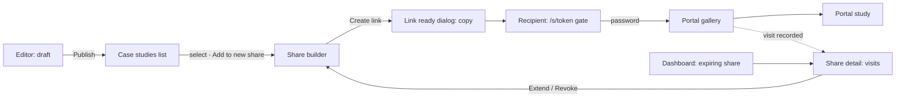

I couldn't run the bundled contrast script here because code execution isn't available in this conversation. Every ratio below was calculated by hand with the WCAG 2.x relative-luminance formula; re-run `contrast_check.py` (or axe in CI) before you lock the palette. The full document follows.

---

# Digital Covet Portfolio: UI/UX Design System & Implementation Plan

> **Assumptions:**
> - **Brand attributes** (inferred from "Modern SaaS"): crisp, confident, discreet, crafted.
> - **Audience:** Digital Covet designers and account managers (staff and admin roles), plus external client recipients on the portal.
> - **Platform:** desktop-first web app with responsive support down to 375px.
> - **Existing choices kept:** dark-first theme with a light toggle; Jost, Rubik and JetBrains Mono; Base UI with Tailwind v4 and Lucide.
> - **Brand color:** none was given, so a violet primary is proposed.
> - **Inferred route:** `/s/:token/:slug` for opening one study inside the portal.
> - **Identity:** the account and profile are owned by IAM, so the app has no settings page.

**Inputs:**
- **Concept:** an internal case-study catalogue with access-controlled client share links.
- **Audience:** agency staff in daily use; client recipients occasionally.
- **Platform/stack:** AdonisJS 7, Inertia 3, React 19, Tailwind 4, `@base-ui/react`, `lucide-react`.
- **Brand:** Modern SaaS.

## 1. Strategic Design Direction & Trend Fit

**Primary paradigm: Minimalist Data-Dense (lead) with a Bento Grid for the dashboard.** Staff spend their day filtering, classifying and monitoring, so they need quiet surfaces, tight rhythm and strong type hierarchy. The bento grid only organises the dashboard's mixed widgets. The public portal shifts to an image-first editorial layout, because its whole job is to make the work look good.

**Category benchmarks (borrow patterns only):**

| Product | Pattern to borrow |
|---|---|
| Linear | Grouped left sidebar, ⌘K palette, keyboard-first dense tables, `G then X` navigation |
| DocSend | Link-level controls (passcode, expiry) and a per-link visit timeline. This is the model for Share detail. |
| Vercel dashboard | Status-badge lists with relative timestamps; calm surfaces where only state carries color |
| Behance project pages | Image-led case-study cards and a large hero for the portal |

**Experience mode per surface:**

| Surface | Mode | Why |
|---|---|---|
| Staff workspace (all `/dashboard`, `/case-studies`, `/shares`, admin pages) | Utility | Repeated cataloguing and monitoring; motion only confirms state |
| Sign in | Expressive | First brand impression; one action |
| Public share portal (`/s/…`) | Expressive | A client-facing showcase, but recipients scan and click, so it isn't scroll theatre |
| Error pages | Expressive | Branded frame, with a single route back |

**Signature elements (derived from agency production and distribution):**

1. **Crop marks.** *Family:* structural shape language.
   - *Spec:* four L-shaped corner ticks with a 10px arm, a 1px stroke in `--accent` at 70%, and a 6px offset outside the frame. Published work uses solid ticks; drafts use dashed ticks (4/3), always paired with a status badge.
   - *Source:* the trim marks on print proofs that signal "this is final artwork."
   - *Meaning:* this is finished, presentable work.
   - *Fit:* hero image frames (editor hero slot, detail hero, portal cover) and the dashboard's "Latest published" thumbnail. Strongest at 16–24px ticks around a large hero. Never on frames under 120px wide, never in table rows, never around form inputs.
   - *Rules:* static CSS pseudo-elements with `aria-hidden`. The only motion is the publish draw-in described in Section 4.
2. **Folio number.** *Family:* typographic device.
   - *Spec:* "Nº 0142" in JetBrains Mono 12px, uppercase, 0.08em tracking, tabular numerals, `--muted-foreground`, zero-padded to 4 digits from the study's sequence.
   - *Source:* the catalogue numbering in printed portfolios and archive boxes.
   - *Meaning:* each study is a catalogued asset with a stable reference staff can quote on calls.
   - *Fit:* the list's lead column, the detail and editor headers, portal cards and selection trays. It is real data, so it may sit in rows. Never enlarge it beyond 14px or use it as a background.
3. **Admission stub.** *Families:* structural shape plus data used as ornament.
   - *Spec:* a card edge cut by a perforation line, made with a CSS `mask` of 4px radial notches every 12px. It separates a 104px stub showing views used against the cap in mono ("18/25"), the expiry date, and a lock glyph when the link has a password.
   - *Source:* a ticket stub, because a share link admits a limited number of views and expires like a ticket.
   - *Meaning:* how much access is left, at a glance.
   - *Fit:* the share builder's live preview, the share detail summary, the dashboard's share-health card and the portal password gate. Never inside table rows; tables use a `Meter` instead.
   - *Rules:* static. Stub text must pass AA on `--surface-raised`.
4. **Contact sheet.** *Family:* image and photo treatment.
   - *Spec:* 4:3 thumbnails in a strip with 2px gaps on `--surface-raised` and a 6px radius on the strip, not on the frames. A mono frame index sits under each frame ("01 02 03", 10px). The selected frame gets a 2px `--primary` outline.
   - *Source:* the photographer's contact sheet and lightbox, which is how agencies review and pick frames.
   - *Meaning:* this is a selection of work.
   - *Fit:* the editor gallery, the share builder's selection tray, the portal hero band, and empty-state illustrations (drawn as blank frames). Never used as a background texture.

**Anti-patterns for this product:**
- **Monospace as the UI's voice.** JetBrains Mono everywhere would read as a developer tool to account managers. Confine it to folio numbers, tokens, counts and timestamps.
- **Silent live rules.** A rule-based share whose contents grow as new studies publish is an exposure risk if the UI doesn't say so on every surface that shows the share.
- **Glass and blur over case-study imagery.** It muddies the work being sold. Portal surfaces sit beside imagery, not over it, except for the scrimmed hero title.
- **Disabled admin nav items for staff.** These advertise features users can't reach. Hide them instead, and let the 403 page handle direct URLs.
- **Showing view counts to recipients.** "3 views left" pressures clients and leaks internal settings. Recipients see expiry only.

## 2. Visual Language & Ergonomics

### Color (ratios calculated by hand; verify with the script)

**Core palette (dark, the default):**

| Role | Hex | Usage | Contrast |
|---|---|---|---|
| Primary | `#8B7BFF` | Primary buttons, focus ring, active nav icon, links | Label `#0B0D12` on fill **5.90:1**; as text on canvas 5.90, on card 5.44, on raised 5.00 |
| Secondary | `#2A2F3B` | Secondary button fill, chips | `#ECEEF3` on it **11.54:1** |
| Accent | `#F28DB2` | Crop marks, highlights, chart series 2 | On canvas 8.54, on card 7.87 |
| Background/Canvas | `#0B0D12` | App canvas | Body `#ECEEF3` **16.74**, muted `#9AA1B2` **7.51** |
| Surface/Card | `#14171F` | Cards, tables | Body **15.44**, muted **6.92** |

**Light mode:**

| Role | Hex | Contrast |
|---|---|---|
| Primary | `#5B47F0` | White label 5.83; as text on white 5.83 |
| Secondary | `#EEF0F4` | Foreground `#0F1117` on it, est. >15 (not hand-checked; verify) |
| Accent | `#B8336A` | On white 5.65, on canvas 5.31 |
| Canvas | `#F7F8FA` | Foreground `#0F1117` 17.76, muted `#5B6272` 5.75 |
| Surface | `#FFFFFF` | Foreground 18.87, muted 6.11 |

**Semantic colors.** Every status pairs a Lucide icon with a text label, never hue alone (WCAG 1.4.1).

| State | Dark hex · on canvas / card | Light hex · on white | Icon |
|---|---|---|---|
| Success (Published, Active) | `#3FCF8E` · 9.74 / 8.98 | `#0F7B4A` · 5.31 | `CircleCheck` |
| Warning (Expiring ≤7d, Draft) | `#F59E0B` · 9.05 / 8.34 | `#A15C00` · 5.19 | `Clock` |
| Error (Expired, Limit reached, Revoked) | `#F87171` · 7.03 / 6.48 | `#C62828` · 5.62 | `CircleX` |
| Info (Live rule, Archived) | `#60A5FA` · 7.64 / 7.05 | `#1D63C9` · 5.71 | `Info` |

**Component boundaries** (WCAG 1.4.11, 3:1 minimum). Input and checkbox borders use `--border-strong`: `#646C80` dark (3.41 on card, 3.14 on raised) and `#8A92A3` light (3.12 on white). Decorative dividers use `--border` (`#232836` dark, `#E4E7EC` light), which is exempt.

### Surface levels

| Level | Dark | Light | Border | Shadow |
|---|---|---|---|---|
| L0 Canvas | `#0B0D12` | `#F7F8FA` | — | — |
| L1 Sidebar | `#0F1117` | `#F1F3F6` | right 1px `--border` | — |
| L2 Card/table | `#14171F` | `#FFFFFF` | 1px `--border` | dark none · light `0 1px 2px rgb(16 24 40/.06)` |
| L3 Popover/menu/dialog | `#1B1F29` | `#FFFFFF` | 1px `#2E3442` / `#E4E7EC` | `0 12px 32px rgb(0 0 0/.45)` / `rgb(16 24 40/.12)` |

Text checks on the shell: sidebar body text 16.26 and muted 7.29 (dark); light sidebar muted 5.50. The active nav item has a `primary/10` fill (≈`#1B1C2E` dark, ≈`#E2E2F5` light). Its label is `--foreground` (14.45 dark, 14.76 light) and its icon and 2px bar are `--primary` (5.09 dark, 4.56 light). The label is deliberately not primary-colored in light mode, where primary text on that fill would be too marginal.

### Typography

| Role | Font | Notes |
|---|---|---|
| Display / headings | Jost (variable, 500–600) | Only at 16px and above; geometric, gives the brand its tone |
| Body / UI | Rubik (variable, 400/500) | Tables, forms, copy |
| Data | JetBrains Mono (400/500) | Folio numbers, tokens, counts, timestamps; tabular numerals (`font-variant-numeric: tabular-nums`) |

All three are free Google Fonts. Self-host them through Fontsource variable packages so there are no third-party requests on the client portal.

**Scale** (≈1.2 minor third, snapped to a 4px line grid):
- 12/16: meta, mono
- 13/18: table cells
- 14/20: body
- 16/24: lead, card titles
- 20/28: h3 and section headers
- 24/32: page title
- 32/40: KPI values

The portal adds a fluid display tier: `clamp(2.25rem, 1.5rem + 2.4vw, 3.75rem)` at line-height 1.05, Jost 600.

### Iconography & imagery

**Icons.** `lucide-react` at 1.75 stroke, in three sizes: 16px (buttons, table, badges), 18px (nav), 20px (page-header actions, empty states). Icons are required on every nav item, primary buttons, status badges and menu items.

**Illustrations** are for empty, auth, error and success states:
- **Style:** 1.5px line art in `--muted-foreground` with exactly one `--accent` detail, 120–160px wide.
- **Subjects** come only from the kit: a blank contact sheet, a crop-marked empty frame, a torn admission stub.
- **Rule:** no people and no stock 3D blobs.

This illustration style plus the four signature elements make up the complete **decoration kit**.

### Layout

- **Grid:** 12 columns in Main, 24px gutters.
- **Breakpoints:** sm 640, md 768, lg 1024, xl 1280, 2xl 1536.
- **Spacing:** 4px base (4, 8, 12, 16, 24, 32, 48, 64).
- **Density:** 40px table rows (compact toggle to 32px); 16px card padding on dashboard tiles, 24px on form cards.
- **Touch targets:** 44×44 on touch layouts; never below 24×24 (WCAG 2.2 AA).
- **Region sizing:**
  - Editor: fluid main (max 760px) plus a fixed 340px rail.
  - Share builder: fluid main plus a 380px rail.
  - Share detail: 8/4 columns.
  - Dashboard: a 12-column bento.
  - No 50/50 splits anywhere.
- **Wide screens:** lists and tables cap at 1440px; dashboards and detail pages at 1280px; everything is centered. On the portal, the hero band goes full-bleed and text stays within 68ch.
- **Immersive vocabulary:** portal only. The hero is `min-height: 72svh` on lg and up, with no pinning or scroll snap.

### Design tokens

```css
:root {                       /* dark is the default */
  color-scheme: dark;
  --background:#0B0D12; --sidebar:#0F1117; --surface:#14171F; --surface-raised:#1B1F29;
  --secondary:#2A2F3B; --foreground:#ECEEF3; --muted-foreground:#9AA1B2;
  --border:#232836; --border-raised:#2E3442; --border-strong:#646C80;
  --primary:#8B7BFF; --primary-foreground:#0B0D12; --accent:#F28DB2;
  --success:#3FCF8E; --warning:#F59E0B; --error:#F87171; --info:#60A5FA;
  --shadow-raised:0 12px 32px rgb(0 0 0 / .45);
  --radius-sm:6px; --radius-md:10px; --radius-lg:14px;
  --sidebar-width:256px; --sidebar-rail:64px; --header-h:64px;
  --container:1280px; --container-wide:1440px; --form-max:760px;
  --rail-editor:340px; --rail-share:380px; --prose:68ch;
  --duration-fast:120ms; --duration-base:180ms; --duration-slow:280ms;
  --ease-out:cubic-bezier(.2,0,0,1); --ease-in-out:cubic-bezier(.4,0,.2,1);
  --crop-tick:10px; --crop-offset:6px; --crop-opacity:.7;
  --perf-notch:4px; --perf-gap:12px; --stub-width:104px;
}
[data-theme="light"] {
  color-scheme: light;
  --background:#F7F8FA; --sidebar:#F1F3F6; --surface:#FFFFFF; --surface-raised:#FFFFFF;
  --secondary:#EEF0F4; --foreground:#0F1117; --muted-foreground:#5B6272;
  --border:#E4E7EC; --border-raised:#E4E7EC; --border-strong:#8A92A3;
  --primary:#5B47F0; --primary-foreground:#FFFFFF; --accent:#B8336A;
  --success:#0F7B4A; --warning:#A15C00; --error:#C62828; --info:#1D63C9;
  --shadow-raised:0 12px 32px rgb(16 24 40 / .12);
}
@theme inline {
  --color-background:var(--background); --color-sidebar:var(--sidebar);
  --color-surface:var(--surface); --color-surface-raised:var(--surface-raised);
  --color-secondary:var(--secondary); --color-foreground:var(--foreground);
  --color-muted-foreground:var(--muted-foreground); --color-border:var(--border);
  --color-border-strong:var(--border-strong); --color-primary:var(--primary);
  --color-primary-foreground:var(--primary-foreground); --color-accent:var(--accent);
  --color-success:var(--success); --color-warning:var(--warning);
  --color-error:var(--error); --color-info:var(--info);
  --font-display:"Jost Variable", ui-sans-serif, system-ui, sans-serif;
  --font-sans:"Rubik Variable", ui-sans-serif, system-ui, sans-serif;
  --font-mono:"JetBrains Mono Variable", ui-monospace, monospace;
  --radius-sm:var(--radius-sm); --radius-md:var(--radius-md); --radius-lg:var(--radius-lg);
  --ease-out:var(--ease-out);
}
```

## 3. Motion & Immersion Strategy (Necessity Analysis)

| Tier | Workspace (Utility) | Sign in / Errors | Portal (Expressive) |
|---|---|---|---|
| 1 Micro-interactions & transitions | **YES** | **YES** | **YES** |
| 2 Scroll-linked | **NO** | **NO** | **SELECTIVE**: card reveals only |
| 3 Lottie / Rive | **NO** | **NO** | **NO** |
| 4 3D | **NO** | **NO** | **NO** |

**Tier 1** confirms state where it matters most: publish, link copied, revoke, sidebar collapse, and the toast queue. It is CSS-first, with `motion` used only for layout-shared animation (the active-nav indicator).

**Tier 2** is limited to the portal. A one-time fade-up as each card enters gives the gallery a crafted feel without delaying anything. It uses CSS scroll-driven animations behind `@supports (animation-timeline: view())`; browsers without support show static cards, and no JS runs. In the workspace, scroll effects would slow scanning.

**Tier 3** is a NO because the only candidate (the share-created success moment) is achieved with a CSS stroke draw on the stub illustration. A Lottie runtime would cost far more than that.

**Tier 4** is a NO because nothing in the product is spatial. 3D would also compete with the client's work, and on the portal it would risk LCP.

**Costs paid:**
- Tier 2 costs 0KB of JS.
- `motion` loads through `LazyMotion` with `domAnimation` features to cut the bundle.
- Every effect has a `prefers-reduced-motion` path (see Section 4).

## 4. Animation & Interaction Blueprint

1. **Sidebar collapse.**
   - *Behavior:* width animates 256 → 64px over `--duration-base` with `--ease-out`. Labels fade out over 120ms, *before* the width change, so text never clips. Icons stay put.
   - *Purpose:* keeps spatial memory of item positions.
   - *Reduced motion:* instant swap.
2. **Active nav indicator.**
   - *Behavior:* the 2px bar and the `primary/10` fill move between items via `motion` `layoutId="nav-active"` over 180ms.
   - *Purpose:* confirms where you went during Inertia navigation.
   - *Reduced motion:* no slide; the fill switches instantly.
3. **Page content transition.**
   - *Behavior:* Main content cross-fades over 120ms through `document.startViewTransition` where supported, wrapped around Inertia visits. The shell never animates.
   - *Open check:* whether Inertia 3 exposes a built-in view-transition option.
   - *Reduced motion:* off.
4. **Publish draw-in.**
   - *Behavior:* on a successful Draft → Published change, the hero's dashed crop marks redraw as solid (stroke-dashoffset, 280ms). The status badge cross-fades (150ms) and a toast confirms "Published".
   - *Purpose:* makes the state change unmistakable on the asset itself.
   - *Reduced motion:* instant swap; the toast still shows.
5. **Copy-link confirmation.**
   - *Behavior:* the button icon morphs `Copy` → `Check` (150ms), holds for 1.5s, then reverts. Screen readers hear "Link copied" through a polite live region.
   - *Reduced motion:* icon swap without the morph.
6. **Toasts** (Base UI `Toast`).
   - *Behavior:* enter by translating Y 8px → 0 with opacity over 160ms; exit with opacity over 120ms; stacked bottom-right with a 5s timeout. Revoke and delete toasts carry an "Undo" action and a 8s timeout.
   - *Reduced motion:* opacity only.
7. **Stub meter fill.**
   - *Behavior:* the `Meter` in the admission stub fills from 0 to its value over 400ms with `--ease-out` on first paint only.
   - *Reduced motion:* rendered at its value.
8. **Portal card reveal** (scroll-linked).
   - *Timeline:* `animation-timeline: view()`, `animation-range: entry 0% entry 35%`, scrubbed.
   - *Properties:* at 0, opacity 0 and translateY 16px; at 0.5, opacity 0.7 and translateY 6px; at 1, opacity 1 and translateY 0. No pinning.
   - *Reduced motion and unsupported browsers:* static, fully visible.

## 5. Technical Implementation Roadmap

### Libraries

| Package | Role |
|---|---|
| `@base-ui/react` (v1.8.0 at time of check) | All interactive primitives |
| Local components (Tailwind) | Sidebar, PageHeader, Card, Badge, Table (semantic `<table>`), EmptyState, Skeleton, Kbd, AdmissionStub, CropFrame, ContactSheet |
| `@tanstack/react-table` | Headless column, sort and selection state for case-study and share tables; pagination stays server-side via Inertia |
| `lucide-react` | Icons |
| `recharts` (v3.x) | Views series (area chart), device split (bar), sparklines |
| `react-day-picker` | Expiry calendar inside a `Popover`; confirm the version and React 19 peer at install |
| `motion` (`motion/react`, `LazyMotion` + `domAnimation`) | Active-nav layout animation; nothing else |
| `@dnd-kit/core` + `@dnd-kit/sortable` | Gallery and attachment reordering in the editor, with keyboard sensors on; check whether the newer `@dnd-kit/react` API is preferable at install |
| `@fontsource-variable/jost`, `/rubik`, `/jetbrains-mono` | Self-hosted fonts |

The Base UI primitives the specs rely on, all confirmed in its component index:
- Overlays: Dialog, AlertDialog, Drawer, Popover, PreviewCard, Tooltip
- Menus: Menu
- Selection inputs: Select, Combobox, Autocomplete, CheckboxGroup, RadioGroup, Switch
- Forms: Field, Fieldset, Form, Input, NumberField
- Structure: Tabs, ToggleGroup, Toolbar, ScrollArea, Separator, Collapsible
- Display and feedback: Avatar, Meter, Progress, Toast
- Actions: Button

Base UI has **no** Table, Card, Badge, Sidebar or Calendar, which is why those are local components or come from the packages in the table above.

The **command palette (⌘K)** is Base UI `Autocomplete` rendered inside `Dialog`, with grouped results: Pages, Case studies (by title or folio Nº), Shares, and Actions ("New case study", "New share").

### Performance budget

| Target | Value |
|---|---|
| Frame budget | 16.7ms; animate only `transform` and `opacity` (width collapse is the single exception, on one element) |
| JS for motion | ≤ 25KB gz; charts lazy-loaded on Dashboard and Share detail only |
| Workspace LCP | ≤ 2.5s; the page title or first table row, never a chart |
| Portal LCP | ≤ 2.5s; the H1 text, with the first cover image `fetchpriority="high"`, AVIF/WebP, explicit `sizes`, explicit dimensions |
| INP | ≤ 200ms; filter changes debounced 250ms, Inertia partial reloads with `only: [...]` |
| CLS | ≤ 0.1; skeletons match final layouts and images reserve 4:3 |

### Fallbacks

- **Reduced motion:** every Section 4 element has a static equivalent listed with it.
- **Low power:** portal reveals are pure CSS, so nothing extra degrades.
- **No JS:** the Inertia app needs JS. The portal password form should still submit through a normal POST so recipients on locked-down corporate browsers can get in; verify with SSR.

### Code skeleton: the app shell

```tsx
// resources/js/layouts/app_shell.tsx
import { Link, usePage } from '@inertiajs/react'
import { Dialog } from '@base-ui/react/dialog'
import { Tooltip } from '@base-ui/react/tooltip'
import { LazyMotion, domAnimation, m, useReducedMotion } from 'motion/react'
import { LayoutDashboard, FolderOpen, Link2, Building2, Tags, Search,
  PanelLeftClose, PanelLeftOpen, Menu as MenuIcon } from 'lucide-react'
import { useEffect, useState, type ReactNode } from 'react'

type Item = { href: string; label: string; icon: typeof LayoutDashboard; admin?: boolean }
const GROUPS: { label: string; items: Item[] }[] = [
  { label: 'Workspace', items: [
    { href: '/dashboard', label: 'Dashboard', icon: LayoutDashboard },
    { href: '/case-studies', label: 'Case studies', icon: FolderOpen },
    { href: '/shares', label: 'Shares', icon: Link2 } ] },
  { label: 'Library', items: [
    { href: '/clients', label: 'Clients', icon: Building2, admin: true },
    { href: '/taxonomies', label: 'Taxonomies', icon: Tags, admin: true } ] },
]

function Nav({ collapsed }: { collapsed: boolean }) {
  const { url, props } = usePage<{ auth: { isAdmin: boolean } }>()
  const reduce = useReducedMotion()
  return (
    <nav aria-label="Main" className="flex flex-col gap-6 px-3">
      {GROUPS.map((g) => {
        const items = g.items.filter((i) => !i.admin || props.auth.isAdmin) // hide, never disable
        if (!items.length) return null
        return (
          <div key={g.label}>
            {!collapsed && <p className="px-2 pb-1 text-xs font-medium text-muted-foreground">{g.label}</p>}
            <ul className="flex flex-col gap-0.5">
              {items.map(({ href, label, icon: Icon }) => {
                const active = url.startsWith(href)
                const link = (
                  <Link href={href} aria-current={active ? 'page' : undefined}
                    className="relative flex h-9 items-center gap-3 rounded-md px-2 text-sm text-muted-foreground hover:bg-secondary hover:text-foreground aria-[current=page]:text-foreground">
                    {active && (
                      <m.span layoutId={reduce ? undefined : 'nav-active'}
                        transition={{ duration: 0.18, ease: [0.2, 0, 0, 1] }}
                        className="absolute inset-0 rounded-md bg-primary/10 before:absolute before:inset-y-2 before:left-0 before:w-0.5 before:rounded-full before:bg-primary" />
                    )}
                    <Icon size={18} strokeWidth={1.75} className={`relative ${active ? 'text-primary' : ''}`} aria-hidden />
                    <span className={`relative transition-opacity duration-[120ms] ${collapsed ? 'sr-only' : ''}`}>{label}</span>
                  </Link>
                )
                return (
                  <li key={href}>
                    {collapsed ? (
                      <Tooltip.Root>
                        <Tooltip.Trigger render={link} />
                        <Tooltip.Portal><Tooltip.Positioner side="right" sideOffset={8}>
                          <Tooltip.Popup className="rounded-md bg-surface-raised px-2 py-1 text-xs shadow-[var(--shadow-raised)]">{label}</Tooltip.Popup>
                        </Tooltip.Positioner></Tooltip.Portal>
                      </Tooltip.Root>
                    ) : link}
                  </li>
                )
              })}
            </ul>
          </div>
        )
      })}
    </nav>
  )
}

export function AppShell({ children, onOpenPalette }: { children: ReactNode; onOpenPalette: () => void }) {
  const [collapsed, setCollapsed] = useState(false)
  useEffect(() => { setCollapsed(localStorage.getItem('sidebar') === 'rail' || innerWidth < 1280) }, [])
  const toggle = () => { const next = !collapsed; setCollapsed(next); localStorage.setItem('sidebar', next ? 'rail' : 'open') }
  return (
    <LazyMotion features={domAnimation}>
      <Tooltip.Provider delay={400}>
        <div className="flex min-h-svh bg-background text-foreground">
          <aside style={{ width: collapsed ? 'var(--sidebar-rail)' : 'var(--sidebar-width)' }}
            className="sticky top-0 hidden h-svh shrink-0 flex-col gap-4 border-r border-border bg-sidebar py-4 transition-[width] duration-[180ms] ease-[var(--ease-out)] motion-reduce:transition-none md:flex">
            {/* SidebarHeader: WorkspaceMark + search trigger, see 6.2 */}
            <button onClick={onOpenPalette} className="mx-3 flex h-9 items-center gap-2 rounded-md border border-border px-2 text-sm text-muted-foreground">
              <Search size={16} aria-hidden /> {!collapsed && <>Search <kbd className="ml-auto font-mono text-xs">⌘K</kbd></>}
              {collapsed && <span className="sr-only">Search</span>}
            </button>
            <Nav collapsed={collapsed} />
            <button onClick={toggle} aria-label={collapsed ? 'Expand sidebar' : 'Collapse sidebar'} className="mx-3 mt-auto flex h-9 items-center justify-center rounded-md hover:bg-secondary">
              {collapsed ? <PanelLeftOpen size={18} /> : <PanelLeftClose size={18} />}
            </button>
          </aside>
          <Dialog.Root>{/* < 768px: drawer */}
            <Dialog.Trigger className="fixed left-3 top-3 z-10 rounded-md p-2 md:hidden" aria-label="Open navigation"><MenuIcon size={20} /></Dialog.Trigger>
            <Dialog.Portal>
              <Dialog.Backdrop className="fixed inset-0 bg-black/50" />
              <Dialog.Popup className="fixed inset-y-0 left-0 w-[280px] bg-sidebar py-4">
                <Dialog.Title className="sr-only">Navigation</Dialog.Title><Nav collapsed={false} />
              </Dialog.Popup>
            </Dialog.Portal>
          </Dialog.Root>
          <main className="min-w-0 flex-1 px-4 pb-16 md:px-8">{children}</main>
        </div>
      </Tooltip.Provider>
    </LazyMotion>
  )
}
```

Base UI's `Drawer` (which supports swipe to dismiss) can replace the mobile `Dialog` once its API is checked against v1.8.

### Phasing

1. Tokens and fonts.
2. Shell, PageHeader, Table, Badge and Toast.
3. Case-study list and editor.
4. Shares: builder and detail.
5. Portal.
6. Decoration kit (CropFrame, AdmissionStub, ContactSheet, illustrations).
7. Motion polish.

## 6. App Shell & Page-by-Page UX Specification

> **How to build from this section.** Implement each page from its **component blueprint**, using the named components, variants and tokens from Sections 2 and 5. Proportion sketches show only relative size and position: do not reproduce their borders, box-drawing characters, monospace text or labels. Every app page renders inside the **App Shell** below, even though page blueprints omit it. Decorative elements appear in blueprints as `Decor` nodes and are specified in each page's **Decoration** field and in the decoration map; build them as specified and add no decoration that isn't listed. Copy in quotation marks is final UI text; everything else is description.

### 6.1 Page inventory

| Page | Route | Purpose | Mode | Priority | Nav placement | Main data |
|---|---|---|---|---|---|---|
| Sign in | `/login` | Start the IAM OAuth (PKCE) flow | Expressive | Supporting | none | none |
| Dashboard | `/dashboard` | What needs attention today | Utility | Core | primary | status counts, publish deltas, share health, views series, attention items |
| Case studies | `/case-studies` | Find, filter and bulk-manage | Utility | Core | primary | paginated studies, taxonomy facets |
| Case-study detail | `/case-studies/:id` | Verify content and reuse | Utility | Supporting | contextual | study, shares containing it |
| Case-study editor | `/case-studies/new`, `/:id/edit` | Author and publish | Utility | Core | contextual and ⌘K | study, taxonomy, clients |
| Shares | `/shares` | Lifecycle control room | Utility | Core | primary | shares with status, views/cap, expiry |
| Share builder | `/shares/new`, `/:id/edit` | Package and protect | Utility | Core | contextual and ⌘K | published studies, rule match preview |
| Share detail | `/shares/:id` | Engagement and controls | Utility | Core | contextual | share, visits, devices, contents |
| Clients | `/clients` | Client master data (admin+) | Utility | Supporting | primary, Library group (admin only) | clients, logo, counts, derived key businesses |
| Taxonomies | `/taxonomies` | Controlled vocabulary (admin+) | Utility | Supporting | primary, Library group (admin only) | trees and flat lists |
| Share portal | `/s/:token` | Password gate, gallery, expiry and limit states | Expressive | Core | none (external) | published studies in the share |
| Portal study (inferred) | `/s/:token/:slug` | Read one study | Expressive | Core | contextual | one study |
| Forbidden / Not found / Server error | 403 · 404 · 5xx | Branded way out | Expressive | Utility | none | none |

### 6.2 App shell & navigation

**Pattern:** a persistent left sidebar, like Linear's. The product has three or more destinations used daily, plus admin libraries. A ⌘K palette sits alongside it. There is no top bar.

```
AppShell
├─ Sidebar  (256px bg-sidebar border-r · auto-rail 64px at <1280px, user-toggle persisted · Dialog/Drawer 280px at <768px)
│  ├─ SidebarHeader (h 56px · px-3)
│  │  ├─ Logo mark 24px + "Digital Covet" (Jost 600 16px) + "Portfolio" (12px muted)   — rail: mark only
│  ├─ SearchTrigger  Button ghost w-full h-9 border-border · Search 16 · "Search" · Kbd "⌘K"
│  ├─ SidebarGroup "Workspace"
│  │  ├─ NavItem "Dashboard"     LayoutDashboard  /dashboard    shortcut G D
│  │  ├─ NavItem "Case studies"  FolderOpen       /case-studies shortcut G C · Badge count drafts (warning tint, mono 11px)
│  │  └─ NavItem "Shares"        Link2            /shares       shortcut G S · Badge count expiring ≤7d (warning tint)
│  ├─ SidebarGroup "Library"  (rendered only for admin+)
│  │  ├─ NavItem "Clients"       Building2   /clients
│  │  └─ NavItem "Taxonomies"    Tags        /taxonomies
│  │     item: h-9 · radius-md · 14px · hover bg-secondary · active bg-primary/10 + 2px left bar primary + icon primary + label foreground
│  └─ SidebarFooter (mt-auto · border-t)
│     ├─ ThemeToggle  ToggleGroup (Sun / Moon / Monitor) 28px
│     ├─ Collapse  Button icon PanelLeftClose/Open · Tooltip "Collapse sidebar  ["
│     └─ UserMenu  Menu: Avatar 28 + name + role Badge → "Manage account" (IAM, ExternalLink) · "Sign out" (LogOut)
└─ Main  (fluid · px-8 lg / px-4 sm · content max per page: 1280 or 1440 centered)
   ├─ PageHeader  (h-auto min 64px · pt-6 pb-4 · sticky top-0 bg-background/90 backdrop-blur-sm border-b on scroll only)
   │  ├─ Breadcrumb (12px muted, only on detail/editor pages)
   │  ├─ Title  Jost 600 24/32 · optional Description 14px muted max 68ch
   │  └─ Actions right: max 1 primary + 1 secondary + overflow Menu (MoreHorizontal)
   └─ page content
```

- **Creation triggers** live in page headers: "New case study" on Case studies and "New share" on Shares. The dashboard header carries both, one primary and one secondary. ⌘K "Actions" and the `N` key on list pages are secondary routes. No sidebar create button, which avoids duplicate visible triggers.
- **Breakpoints:**
  - ≥1280: full sidebar.
  - 1024–1279: auto icon rail, with tooltips on labels.
  - 768–1023: rail.
  - <768: the sidebar becomes a drawer opened from a 44px trigger in the page header's left slot, and page-header actions collapse into one primary plus a menu.
- **Shell decoration:** **Trace**. The only decoration is the logo mark. The active-item bar is functional, not decorative. Nothing sits behind nav items.
- **Page header variant:** none decorated in the workspace. Decoration on pages anchors to cards, not to the header.

### 6.3 Decoration map

| Page | Intensity | Elements | Anchored to | States | Motion | Job |
|---|---|---|---|---|---|---|
| Sign in | Feature | Contact sheet (blank frames illustration), Crop marks | Left brand panel (full height, 55%) | Default | Static | Brand moment before any client work is visible |
| Dashboard | Accent | Crop marks; Admission stub | "Latest published" thumbnail; Share-health card right edge | Default; empty | Publish draw-in n/a; Stub meter fill | Ties the overview to the two core assets: work and access |
| Case studies | Trace | Folio number | Lead table column / grid card footer | Default | Static | A quotable catalogue reference |
| Case-study detail | Accent | Crop marks, Folio number | Hero image frame; header eyebrow | Default; draft (dashed) | Static | Shows publish state on the asset itself |
| Case-study editor | Trace | Crop marks, Contact sheet, Folio | Hero dropzone frame; Gallery field; header eyebrow | Default, empty hero, draft→published | Publish draw-in | Previews "presentable" while authoring |
| Clients | Trace | Contact-sheet frame treatment | Client logo tiles (4:3 frame) | Default | Static | Consistent framing of logos |
| Taxonomies | Trace | None beyond shape language; illustration only in empty | EmptyState | Empty | Static | Keep the vocabulary editor clean |
| Shares | Trace | Folio-style mono token | "Link" column | Default | Static | A link reference staff can say aloud |
| Share builder | Accent | Admission stub, Contact sheet | Rail "Access preview" card; selection tray | Default, empty selection | Stub meter fill | Shows exactly what the link admits before creating it |
| Share detail | Accent | Admission stub | Summary card | Active / expiring / expired / limit | Stub meter fill | Remaining access at a glance |
| Share portal | Feature | Contact sheet, Crop marks, Admission stub (gate only) | Hero band right 50% (full-bleed); gate card | Gate, gallery, expired, limit | Card reveal (Section 4 #8) | The client's first impression of the work |
| Portal study | Accent | Crop marks, Folio | Hero image; meta row | Default | Static | Continuity with the gallery |
| 403 / 404 | Accent | Crop-marked empty frame illustration | Above message | Default | Static | Branded dead-end recovery |
| 5xx | Accent | Torn admission stub illustration | Above message | Default | Static | Calm acknowledgement |

### 6.4 Page specs

### Dashboard — `/dashboard` · Mode: Utility · Nav: Workspace › Dashboard

**User goal:** see in under 10 seconds what to publish, which shares need action, and whether clients are engaging. Success is clicking straight into an attention item.

**Entry points:** post-login landing, `G D`, the sidebar.

**Blueprint:**
```
PageHeader  title "Dashboard" · description "Portfolio health for {Today, 9 Oct}"
  actions: Button primary "New case study" (Plus) · Button secondary "New share" (Link2)
Grid 12 cols gap-6 (max 1280)
├─ KPI row (4 × Card col-span-3 p-4)
│  ├─ KpiCard "Published"     value mono 32px · delta Badge (TrendingUp, success) "+3 this month"
│  ├─ KpiCard "Drafts"        value · subtext "2 older than 14 days" (warning icon) → link /case-studies?status=draft
│  ├─ KpiCard "Active shares" value · Sparkline (recharts, 40px, primary)
│  └─ KpiCard "Views · 30 days" value · delta Badge
├─ Card "Needs attention"  col-span-8  (agenda list, grouped)
│  ├─ Tabs: "All" · "Drafts" · "Shares"
│  ├─ Group "Today" / "This week" / "Later"  (section header 12px muted uppercase)
│  │  └─ AttentionRow h-14: status icon+Badge · title (14 medium) · meta (mono 12 muted: Nº / expiry) · Button ghost sm "Open"
│  └─ empty → EmptyState (Decor ContactSheetIllustration 120px) "Nothing needs you today." · Button secondary "Browse case studies"
├─ Card "Share health"  col-span-4  relative overflow-hidden pr-[var(--stub-width)]
│  ├─ SegmentedBar h-2: Active (success) · Expiring (warning) · Expired (error) · Limit reached (error, hatched via SVG pattern) + legend with icons and counts
│  └─ Decor AdmissionStub (aria-hidden on perforation only · absolute right-0 inset-y-0 w-[104px] · shows "EXPIRING" + count mono 32px + "≤ 7 days")
├─ Card "Views"  col-span-8  h-[280px]  AreaChart recharts: series primary fill primary/15 · ToggleGroup "7D · 30D · 90D"
└─ Card "Latest published"  col-span-4
   ├─ Decor CropFrame (ticks 12px, accent 70%) wrapping Image 4:3 rounded-md
   ├─ Folio "Nº 0142" · Title 16 · Client Avatar 20 + name
   └─ Link "View study" (ArrowRight)
```

**Visual treatment:**
- **Focal point:** the "Needs attention" card, the largest card with the strongest type contrast. KPI values are mono 32px foreground with no color unless there is a delta.
- **Surfaces:** canvas L0 under L2 cards; no L3 except menus.
- **Icons:** status icons on every row; category color is not used here.
- **Density:** 24px grid gap, 16px card padding, 56px attention rows.

**Decoration:** Accent.
- **Crop marks** frame the Latest-published thumbnail: 12px ticks, `--accent` at 70%, 6px outside the image, layered above the card and below text, default state only. Hidden at <768px, where the card stacks.
- **Admission stub** sits on the Share-health right edge: 104px wide, perforation of `--perf-notch` every `--perf-gap` in `--border-raised`, stub text foreground on `--surface-raised` (14.19:1), default state. *Stub meter fill* applies. At <1024px it becomes a 64px top strip.
- **Empty state:** contact-sheet illustration.
- **Kept clear:** attention rows, the Views chart plot area, KPI values.
- **Contrast:** no text sits over decoration.

**Proportions only — do not reproduce**
```
┌──────┬───────────────────────────────────────────┐
│Side- │ Page header                         [1]   │
│bar   ├──────────┬──────────┬──────────┬──────────┤
│      │ KPI      │ KPI      │ KPI      │ KPI      │
│      ├──────────┴──────────┴─────┬────┴──────────┤
│      │ Needs attention [2]       │ Share health  │
│      ├───────────────────────────┼───────────────┤
│      │ Views [3]                 │ Latest pub.   │
└──────┴───────────────────────────┴───────────────┘
```
1 = two creation actions · 2 = 8 of 12 cols · 3 = 280px tall

**Layout:** 8/4 split because attention is the task; capped at 1280px.

**States:**
- **Loading:** skeletons per card at final heights.
- **Empty workspace (no studies):** KPI row hidden; "Needs attention" shows "Add your first case study" with the single primary in the header. No second create button.
- **Error:** per-card inline "Couldn't load views" plus Button "Retry" (partial reload `only:['views']`).

**Interactions & motion:** Stub meter fill; Tabs switch without page load.

**Reduced motion:** static.

**Responsive:**
- <1280: KPI 2×2, everything else full width.
- <768: KPI horizontal ScrollArea, attention first.

**Accessibility:**
- Headings: h1 page, h2 per card.
- The chart has a visually hidden data table.
- Attention rows are links.

**Data:** dashboard props `stats`, `shareHealth`, `attention`, `views` (range via partial reload).

**Cut or merged:** a separate "Recent activity" feed was merged into "Needs attention" because it duplicated the information.

### Case studies — `/case-studies` · Mode: Utility · Nav: Workspace › Case studies

**User goal:** find a study by any facet and act on one or many. Success is time-to-row.

**Entry points:** sidebar, ⌘K, dashboard KPIs (pre-filtered URLs).

**Blueprint:**
```
PageHeader  title "Case studies" · description "{128} studies · {96} published"
  actions: Button primary "New case study" (Plus, Kbd N)
Toolbar (sticky under header · h-12 · gap-2)
├─ Input search w-72 (Search icon) placeholder "Search title, client or Nº"
├─ Tabs status: "All" · "Draft" · "Published" · "Archived"  (counts mono)
├─ FilterButton Popover "Filters" (SlidersHorizontal) → Combobox multi: Sector › Industry › Key business, Category, Service, Business model, Client
├─ ActiveFilterChips (removable · "Clear all")
├─ Select sort: "Recently updated" · "Recently published" · "Title A–Z"
└─ ToggleGroup view: Table (Rows3) · Grid (LayoutGrid)   — persisted
Table view (Card p-0 · rows 40px · max 1440)
├─ th: Checkbox · "Nº" · "Study" · "Client" · "Sector" · "Status" · "Shared in" · "Updated"
└─ tr: Checkbox · Folio mono 12 · Thumb 48×36 rounded-sm + title 14 medium · Avatar 20 + client · sector Badge outline · Status Badge (icon+label) · count mono → PreviewCard listing shares · relative time
Grid view: cards 4 cols xl / 3 lg / 2 md · Image 4:3 · title · client · Status Badge · Folio footer
BulkBar (appears when ≥1 selected · floating bottom-center · L3 surface)
  "{3} selected" · Button "Publish" · Button "Archive" · Button "Add to new share" (Link2) · Button ghost "Clear"
Pagination  "1–25 of 128" · Select page size · Prev/Next
empty (no results) → EmptyState in table body: Decor ContactSheetIllustration 96px · "No studies match these filters." · Button secondary "Clear filters"
empty (no studies) → EmptyState: "Catalogue your first project." (header primary is the action; no second button)
```

**Visual treatment:**
- **Focal point:** the title column (14 medium foreground); everything else is muted.
- **Surfaces:** the table on an L2 card; BulkBar on L3.
- **Icons:** status badge icons; Thumb gives visual recognition.
- **Density:** 40px rows, compact 32px via the Toolbar's overflow menu.

**Decoration:** Trace.
- **Folio number** in the lead column, mono 12 muted. It is data, so it is allowed in rows.
- **Grid view:** the same folio in the card footer.
- **Empty:** contact-sheet illustration at 96px.
- **Kept clear:** all rows, the toolbar and filters.
- **Contrast:** no text over decoration.

**Layout:** a full-width table capped at 1440px.

**States:**
- **Loading:** 10 skeleton rows.
- **Error:** inline banner over the table with "Retry".
- **Bulk publish with failures:** a toast reading "2 published · 1 needs a hero image" with "Review".

**Interactions & motion:** toasts; BulkBar slides up 8px over 160ms.

**Responsive:**
- <1024: hide the Sector and Shared columns.
- <768: grid view is forced; filters open in a Drawer.

**Accessibility:**
- `j/k` row focus, `x` select, `Enter` open, `e` edit.
- Sortable headers expose `aria-sort`.
- BulkBar announced via live region.

**Data:** Inertia GET with query params (`status`, `q`, filters, `sort`, `page`); `preserveState` and `preserveScroll`.

**Cut or merged:** a per-row "Share" button was dropped; "Add to new share" lives in the BulkBar only.

### Case-study editor — `/case-studies/new`, `/case-studies/:id/edit` · Mode: Utility · Nav: contextual (from list or detail; ⌘K "New case study")

**User goal:** produce a complete, correctly classified study and publish it. Success is publishing without validation surprises.

**Blueprint:**
```
PageHeader  breadcrumb "Case studies / Nº 0142" · title = study title (or "New case study") · eyebrow Folio
  actions: Menu overflow (MoreHorizontal): "View read-only" · "Duplicate" · "Archive" (AlertDialog)
SectionNav  Toolbar sticky top-[64px] · anchor links "Basics · Hero · Story · Gallery · Media · Proof · Files" (active section underline primary)
Layout  flex gap-8: Main (fluid, max 760) + Rail (340px sticky top-[120px])
Main (Form, each section = Card p-6 with h2 20px + description muted)
├─ Basics:  Field "Title" Input · Field "Client" Combobox (create-on-type for admin+, else select-only) · Field "Summary" textarea 3 rows, 280-char Counter
├─ Hero:    Decor CropFrame (ticks 16px · dashed while draft, solid when published) wrapping Dropzone 16:9
│           filled → Image + Toolbar (Replace · Crop focal point · Remove)
├─ Story:   Field "Challenge" · "Approach" · "Outcome"   (textarea autosize; see Risks re rich text)
├─ Gallery: Decor/structure ContactSheet (sortable frames 4:3 160px, frame index mono) + Button secondary "Add images" (ImagePlus)
├─ Media:   Field "Video URL" Input (YouTube/Vimeo) → inline preview 16:9 lazy iframe
├─ Proof:   Metrics repeatable rows: Input value (mono) + Input label · Button ghost "Add metric"
│           Testimonials: Card per quote: textarea quote · Input name · Input role · Button ghost "Add testimonial"
└─ Files:   Attachments list (FileText icon · name · size mono · Remove) + Dropzone compact
Rail
├─ Card "Status"
│  ├─ Status Badge (Draft/Published/Archived) · SaveState text 12 muted "Saved · 2 min ago" (only home for save status)
│  ├─ Button primary w-full "Publish" (Send) — published: "Update" ; archived: "Restore to draft"
│  ├─ Button secondary w-full "Save draft"  (Kbd ⌘S)
│  └─ Readiness list: 4 checks (Title, Client, Hero, Sector) with CircleCheck/Circle icons
└─ Card "Classification"
   ├─ Field "Sector" Select → "Industry" Select (filtered) → "Key business" Combobox (filtered)
   ├─ Field "Work categories" Combobox multi · "Services" Combobox multi · "Business model" Select
   └─ meta 12 muted: Folio · Created · Updated by Avatar
```

**Visual treatment:**
- **Focal point:** the Publish button (the only primary on the page) and the hero frame.
- **Surfaces:** section cards on L2 and the rail on L2; dropzones use a 1px dashed `--border-strong` border.
- **Icons:** each section's h2 gets a 16px icon.
- **Density:** 24px card padding and 32px between cards.

**Decoration:** Trace.
- **Crop marks** around the hero frame: 16px ticks, accent at 70%, 6px outset. Dashed while draft, solid after publish (Publish draw-in). On an empty hero, the ticks frame the dropzone so the 16:9 trim reads before upload. <768: 10px ticks.
- **Contact sheet** in the gallery field: structural treatment as specified in Section 1, selected frame outlined in primary.
- **Folio** in the header eyebrow.
- **Kept clear:** all inputs, labels and the Classification card.
- **Contrast:** no text over decoration.

**Layout:** fluid main with a 340px rail so publish and classification stay visible during long scrolls; above 1440px the whole layout centers.

**States:**
- **New:** Folio shows "Nº —" until first save.
- **Autosave:** drafts autosave after 3s idle. Published studies require an explicit "Update", so live client shares never change mid-edit.
- **Validation:** Publish runs VineJS. Errors attach to their Fields, the page scrolls to the first one, and the Readiness list updates.
- **Leaving with unsaved changes:** AlertDialog.
- **Loading:** a skeleton of the section cards.

**Interactions & motion:** Publish draw-in; toast "Published". If the study belongs to active shares, the toast adds "Now visible in 2 shares."

**Responsive:** <1024: the rail stacks below Basics, and a sticky bottom bar holds "Save draft" and "Publish" (the rail buttons are hidden, so there is still one visible trigger).

**Accessibility:**
- Section h2s act as landmarks.
- Dropzones are focusable with an "Upload" button fallback.
- dnd-kit keyboard sensor for gallery order, with live announcements.

**Data:** Inertia `useForm`; uploads to Supabase storage with progress via `Progress`.

**Cut or merged:** the header's "Publish" duplicate was removed; the rail owns it.

### Share builder — `/shares/new`, `/shares/:id/edit` · Mode: Utility · Nav: contextual (Shares header, case-study BulkBar, ⌘K)

**User goal:** create a protected link containing exactly the intended work. Success means no unintended study is exposed.

**Blueprint:**
```
PageHeader  breadcrumb "Shares" · title "New share" (edit: share name) 
Layout  Main fluid + Rail 380px sticky
Main
├─ Card "Contents"
│  ├─ Field "Share name" Input (internal) placeholder none · helper "Recipients see this as the page title."
│  ├─ RadioGroup as segmented cards: "Pick case studies" (CheckSquare) | "Live rule" (Wand2)
│  ├─ Pick mode:
│  │  ├─ Toolbar: Input search · Filter Popover (same facets as list) — published only
│  │  └─ Table compact 36px: Checkbox · Thumb · title · client · Folio
│  └─ Rule mode:
│     ├─ RuleRows: Select field (Sector/Industry/Key business/Category/Service/Client) + Combobox multi values · Button ghost icon Remove · Button ghost "Add condition"
│     ├─ Callout info (Info icon): "Live rule — case studies published later that match will appear automatically."
│     └─ MatchPreview: "{14} published case studies match now" + list (thumb, title, Folio), first 8 + "Show all"
└─ SelectionTray  (Card · Pick mode only) Decor ContactSheet of selected (frames 96px, reorder = display order) · "{6} selected"
Rail
└─ Card "Access"
   ├─ Field "Password" Switch + Input (type=password, Button icon "Generate" Dices, Button icon reveal Eye)
   ├─ Field "Expires" ToggleGroup "7 days · 14 days · 30 days · Custom" → Popover react-day-picker
   ├─ Field "View limit" Switch + NumberField (min 1)
   ├─ Decor AdmissionStub preview (Card L3 · stub 104px: views "0/25" · expiry "23 Oct" · Lock if password)
   └─ Button primary w-full "Create link" (Link2)   — edit: "Save changes"
Success → Dialog "Link ready"
   ├─ Input readonly URL mono + Button "Copy link"  · password shown once: Input readonly + Button "Copy password"
   └─ Button secondary "View share" · Button ghost "Done"
```

**Visual treatment:**
- **Focal point:** the Access card's stub preview plus the primary action.
- **Surfaces:** L2 cards; the stub preview on L3, so the "ticket" sits above the form.
- **Icons:** mode cards carry 20px icons.
- **Density:** 36px rows in the picker.

**Decoration:** Accent.
- **Admission stub** previews the link above "Create link", in the Access card, 100% of the card width. It updates live and shows "∞" when there's no limit. *Stub meter fill* runs on first render.
- **Contact sheet** is the selection tray: 96px frames with index numbers. When empty, it shows 4 blank frames in the line-illustration style with the text "Select case studies to add them here."
- <768: the stub becomes a 64px strip.
- **Kept clear:** the picker table, rule rows and every field.
- **Contrast:** stub text 14.19:1 on raised.

**Layout:** the Access settings sit beside the create action (proximity rule). The rail is 380px to fit the calendar popover anchor.

**States:**
- Create is disabled with a reason tooltip when no studies are selected or the rule matches 0.
- **Rule with 0 matches:** a warning callout.
- **Error:** an inline field error; settings are preserved.
- **Edit of an expired share:** a banner "This share expired on {date}. Extend the date to reactivate."

**Interactions & motion:** Stub meter fill; Copy-link confirmation.

**Responsive:** <1024: the rail stacks under Contents, and a sticky bottom bar holds "Create link".

**Accessibility:**
- The RadioGroup has arrow-key navigation.
- MatchPreview count is a polite live region.
- The password is never echoed in toasts.

**Data:** the match preview uses a debounced (300ms) partial reload `only:['matchPreview']`.

**Cut or merged:** a separate "Review" step was removed because the stub preview and the tray are the review.

### Share detail — `/shares/:id` · Mode: Utility · Nav: contextual (Shares list, dashboard)

**User goal:** know whether the client engaged, then adjust or revoke. Success is a decision in one screen.

**Blueprint:**
```
PageHeader  breadcrumb "Shares" · title share name · Status Badge · description "Created by {Avatar name} · {date}"
  actions: Button primary "Copy link" (Copy) · Button secondary "Edit" (Pencil) · Menu: "Extend 7 days" · "Revoke link" (AlertDialog, destructive)
Grid 12
├─ Card "Access" col-span-12  flex · pr-[104px] relative
│  ├─ Facts row: Link token mono "s/7F3K…" · Protection (Lock "Password" / "Open") · Type ("Pinned · 6 studies" | Info Badge "Live rule")
│  ├─ Meter views used/cap with label "18 of 25 views"
│  └─ Decor AdmissionStub (absolute right · 104px · "7 / 25 LEFT" · "EXP 23 OCT")
├─ KPI row: "Views" · "Unique visitors" · "Last visit" (relative) — col-span-4 each
├─ Card "Visits over time" col-span-8 h-[260px] AreaChart
├─ Card "Devices" col-span-4 BarChart horizontal (Desktop/Mobile/Tablet, icons in labels)
├─ Card "Visit log" col-span-8  Table 40px: time · device icon+label · browser · studies opened (count → Popover list)
└─ Card "Contents" col-span-4  list: Thumb 40 · title · Folio · (rule: "Matches now: 14" + rule summary chips)
```

**Visual treatment:**
- **Focal point:** the Access card with its stub (remaining access), then views.
- **Surfaces:** L2; chart plot areas are flat.
- **Icons:** device icons (Monitor, Smartphone, Tablet).
- **Density:** standard.

**Decoration:** Accent.
- **Admission stub** on the Access card's right edge, 104px, stub text on raised. In the Expired and Limit-reached states the stub text switches to error color with a CircleX icon, plus a label ("EXPIRED").
- **Revoked state:** the stub shows "REVOKED" and the perforation becomes dashed.
- <768: a top strip.
- **Kept clear:** both charts, the visit log and contents rows.
- **Contrast:** error `#F87171` on raised is about 5.96:1. This value is estimated, not calculated (the hand-checked figures are 7.03 on canvas and 6.48 on card); verify with the script.

**Layout:** 8/4. Logs and charts are the analysis; contents is reference.

**States:**
- **No visits yet:** charts replaced by one EmptyState in the Visits card: "No visits yet. Links are usually opened within 48 hours of sending." It has no button, because "Copy link" is in the header.
- **Loading:** skeletons.

**Interactions & motion:** Copy-link confirmation; revoke toast with "Undo" (8s).

**Responsive:** <1024: everything full width, Access first.

**Accessibility:**
- Charts have hidden data tables.
- The AlertDialog focuses "Cancel" first.

**Data:** `share`, `visits` (paginated), `devices`, `series`.

**Cut or merged:** none.

### Share portal — `/s/:token` · Mode: Expressive · Nav: none (external)

**User goal (recipient):** get in, scan the work, open what's relevant. Success is opening at least one study.

**Blueprint (layout and states, not a scroll storyboard):**
```
PortalFrame (no sidebar · max-w full · bg-background · forced theme: dark, respects OS light via data-theme)
├─ TopBar h-16 px-6 xl:px-12: Digital Covet wordmark · right: "Available until 23 Oct" (Clock 16, muted)
STATE gate (password required)
└─ Center (min-h-svh grid place-items-center)
   └─ Card L3 w-[min(520px,92vw)] flex · Decor CropFrame (ticks 24px, outset 12px, accent 70%)
      ├─ left p-8: eyebrow "Private preview" · h1 Jost 32 "Work selected for you" · Form: Field "Password" Input · Button primary "View work" (ArrowRight)
      └─ Decor AdmissionStub 104px: Lock icon · "PRIVATE" · expiry "23 OCT"
STATE gallery
├─ HeroBand (full-bleed · min-h 72svh lg · grid 12)
│  ├─ col 1–6: eyebrow mono "{12} case studies" · h1 fluid display = share name · lead 18/28 muted max 52ch · Button primary "Start with {first title}"
│  └─ col 7–12 (bleeds right edge): Decor ContactSheet (2 rows × 3 frames of the share's first 6 covers, 4:3, 2px gaps, frame indices) wrapped in Decor CropFrame (ticks 20px)
├─ FilterChips (only if ≥ 9 studies): categories present in this share · "All"
├─ Grid 3 cols xl / 2 md / 1 sm gap-8 max 1280:
│  └─ PortalCard: Image 4:3 rounded-lg (hover: scale 1.02, 200ms) · Folio + category 12 mono muted · title Jost 20 · client · → /s/:token/:slug   (card reveal #8)
└─ Footer: "Questions about this work?" · Button secondary "Contact Digital Covet" (Mail, mailto: owner) · fine print "Shared privately — please don't forward."
STATE expired / limit reached
└─ Center: Decor TornStubIllustration 140px · h1 "This link has expired." | "This link has reached its view limit." · body "Ask your Digital Covet contact for a new link." · Button secondary "Email {owner name}"
```

**Visual treatment:**
- **Focal point:** the H1 share name at display size; second, the contact-sheet hero.
- **Surfaces:** canvas plus image cards; no glass.
- **Imagery:** real covers only.
- **Density:** generous, with 32px gaps and 96px section spacing.

**Decoration:** Feature (at the hero region).
- **Contact sheet:** occupies the hero's right 50% and bleeds off the right edge by 10%. Frames are the share's own covers, so the decoration is drawn from the user's data. It sits on z-0 behind nothing textual.
- **Crop marks:** 20px ticks wrap the sheet.
- **Gate card:** crop marks at 24px plus the admission stub.
- **Expired and limit states:** the torn-stub illustration.
- **Card reveal** applies to grid cards only, never to the hero.
- **Responsive:** <1024, the sheet moves below the text as a 3-frame single row; <640, 2 frames.
- **Reduced motion:** static.
- **Kept clear:** the H1 and lead column, card text, the password field.
- **Contrast:**
  - The H1 sits on canvas, not over imagery (16.74).
  - Portal study heroes use a scrim of the canvas at 80%; worst case is a white image under it, giving 9.34:1.

**Layout:** a 6/6 hero, justified because text and imagery are equal-weight only here; below it a content grid capped at 1280px.

**States:**
- **Loading:** cover images use a dominant-color placeholder.
- **Wrong password:** inline Field error "That password isn't right." with focus kept; rate-limited server-side.
- **Revoked or unknown token:** 404.
- **Missing published studies (all archived):** treated as the expired state with "This collection is no longer available."

**Interactions & motion:** card reveal #8; hover scale.

**Reduced motion:** no reveal, no scale.

**Responsive:** a single column at <640; the TopBar expiry moves under the H1.

**Accessibility:**
- One h1 per state.
- Cards are single links (the whole card) with the title as the accessible name.
- The gate form works without JS (POST).

**Data:** a visit is recorded server-side once per session on gallery load (device and UA). It is not counted on the gate.

**Cut or merged:** the views-remaining display was removed for recipients (see anti-patterns).

**Remaining pages (one line each; decoration per 6.3):**
- **Sign in** (`/login`): 55/45 split. Left brand panel shows the contact-sheet illustration of blank frames with crop marks, never real work. Right side has the wordmark, h1 "Sign in to Portfolio" and one primary "Continue with Digital Covet ID" (KeyRound). Errors from the IAM callback show inline above the button.
- **Case-study detail** (`/case-studies/:id`):
  - *Layout:* 8/4. The main column holds the hero in a crop frame (dashed if draft) followed by the read-only sections; the rail holds Classification and a "Shared in" list of shares with status badges and links.
  - *Header actions:* primary "Edit" and secondary "Add to new share".
- **Clients** (`/clients`, admin+):
  - *Layout:* a table with logo tile (40×30 contact-sheet frame), name, study count and derived key businesses as chips (max 3 shown, then "+n").
  - *Editing:* "New client" opens a Dialog; row click opens an edit Drawer.
- **Taxonomies** (`/taxonomies`, admin+):
  - *Layout:* Tabs for "Sectors", "Work categories", "Services" and "Business models". Sectors render as an Accordion tree (sector › industry › key business) with inline rename and "Add" at each level.
  - *Delete:* an AlertDialog warns "Used by {n} case studies and {m} share rules."
- **Shares** (`/shares`):
  - *Layout:* Tabs "All · Active · Expiring · Expired · Limit reached", then a table with name, mono token, type (Pinned/Live rule badge), a views `Meter` with "18/25", expiry (relative, warning ≤7d) and owner.
  - *Row actions:* a Menu with "Copy link", "Edit", "Revoke".
- **Portal study** (`/s/:token/:slug`):
  - *Hero:* a full-width image (16:9, scrim if the title overlays) inside crop marks.
  - *Body:* folio and meta row, Challenge/Approach/Outcome at 68ch, a metrics strip (mono 32px values), gallery, testimonials, attachments.
  - *Navigation:* sticky "← All work" and "Next study" links.
- **403 / 404 / 5xx:** a centered illustration (crop-marked empty frame, or the torn stub for 5xx) with one h1 and one action:
  - 403: "You don't have access to this page." / "Back to dashboard"
  - 404: "This page doesn't exist." / "Back to dashboard" (or nothing for the portal context)
  - 5xx: "Something went wrong on our side." / "Try again" plus a mono reference ID

**Main flows:**



## Key Risks & Open Questions

1. **Contrast was calculated by hand.** Run the bundled `contrast_check.py` or axe before locking the palette. Three values are tight or unchecked:
   - The light-mode active-nav icon is only 4.56:1, which is why the label uses foreground.
   - The error-on-raised ratio (≈5.96) is estimated, not calculated.
   - The light secondary label ratio is estimated, not calculated.
2. **"View" semantics.** Decide whether a view means a portal session, a gallery load or a study open. The stub copy, the cap logic and the analytics all depend on it; this spec assumes one per session on gallery load.
3. **Live-rule exposure.** Confirm whether publishing a study that matches an active rule share should require acknowledgement, not just the toast. Consider a per-share "notify owner" option.
4. **Rich text in Story fields.** The spec uses structured textareas. If formatted body copy is needed, choose an editor (for example Tiptap) and re-budget editor JS. Also verify whether Inertia 3 offers native view transitions, and check that `react-day-picker` and dnd-kit versions are React 19 compatible at install.

---

**Summary:**
- **Direction:** Minimalist Data-Dense with a bento dashboard.
- **Navigation:** a persistent 256→64px sidebar with ⌘K.
- **Modes:** Utility for the workspace; Expressive for sign-in, portal and errors.
- **Motion:** 3D is a NO; scroll-linked motion is portal-only and pure CSS.
- **Libraries:** led by `@base-ui/react`, with local Card, Table and Badge components.
- **Pages:** 6 fully specified.
- **Decoration spread:** 2 Feature, 7 Accent, 5 Trace.

I can't save files in this conversation, so the document is here in chat; I can move it into a shareable Doc if you'd like.

The most useful next step is a high-fidelity mockup of the app shell with the Dashboard. That's the quickest way to confirm the violet primary, the surface levels and the admission-stub decoration read as intended before anyone builds.